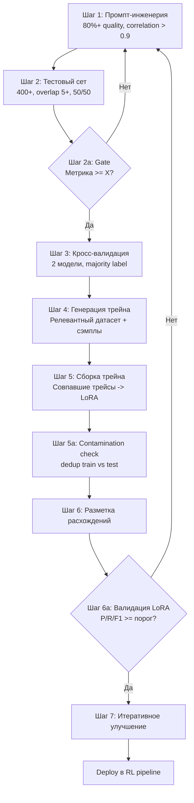

# Гайд по сбору собственного reward

> Извлечено из диалога и [online_rl_ml_data_gap_analysis.md](../online_rl_ml_data_gap_analysis.md). Стандарт для всей команды — каждый новый reward проходит эти шаги.

---

## 1. Формат reward (обязательный)

### Point-wise / Pair-wise / N-rank

Формат зафиксирован для всех reward-ов. Reasoning обязателен в `<critic>` тегах, финальная метка в `\boxed{}`.

| Тип | Формат | Пример |
|-----|--------|--------|
| **Point-wise** | `<critic>reasoning</critic>$\boxed{True/False}$` | True = ошибка есть, False = ошибки нет |
| **Pair-wise** | `<critic>reasoning</critic>$\boxed{A>>B\|A>B\|A==B\|A<B\|A<<B}$` | Сравнение двух ответов |
| **N-rank** | `<critic>reasoning</critic>$\boxed{1\|2\|3\|4\|5}$` | Ранжирование N ответов |

### LoRA-адаптер (для переписывания)

```json
{"has_grammar_spelling_or_punctuation_errors": false, "text_with_objective_corrections": null}
```

### 4-step reward pipeline

| Шаг | Описание |
|-----|----------|
| 0 | Sky-reward (OS baseline) |
| 1 | Point-wise / pair-wise / n-rank reward с форматом выше |
| 2 | Переписывание LoRA-ми |
| 3 | Основная модель обучается на reward + переписывание |

---

## 2. Протокол создания reward (train + test)

### Шаг 1. Промпт-инженерия

Собираем system prompt, который на топ-тир модели даёт **80%+ качества**:
- Reasoning в ответе + boxed финальный скор (формат из раздела 1)
- **Две разные топ-тир модели** должны давать корреляцию **> 0.9** на финальную метку

### Шаг 2. Тестовый сет

Проект разметки должен быть **простым**:
- Минимум инструкций, однозначные критерии, бинарная или ordinal шкала
- Проверяется финальная метка
- Размечаем тестовый сет с **перекрытием 5+** (400+ штук разнообразных задач 50/50 по классам)

### Шаг 2a. Gate

Если метрика на тесте ниже порога X — **итерируем промпт**. Не переходить к шагу 3, пока порог не пройден.

### Шаг 3. Кросс-валидация

Прогоняем 2 топ-тир модели, берём majority метку, считаем метрику относительно размеченного тестового сета:
- Метрика должна быть **>= X**
- **Если ответы моделей расходятся — метка = false**

### Шаг 4. Генерация трейна

- Берём релевантный reward датасет и прогоняем с этим промптом **2 топ-тир модели** (именно те, на которых делали замер Шага 1)
- Дополнительно: берём сэмпл из каждого source трейна (для разнообразия обучающей выборки) и тоже прогоняем обе модели

### Шаг 5. Сборка трейна

Из совпавших трейсов (можно брать оба) собираем train set. Запускаем обучение LoRA.

### Шаг 5a. Contamination check

Перед обучением — **dedup train vs test** (exact + fuzzy match). Тестовый сет не должен утечь в train.

### Шаг 6. Разметка расхождений

Пока LoRA обучается — ставим разъехавшиеся метки на ручную разметку (можно обе). Если разметка тоже расходится — пока выкидываем.

### Шаг 6a. Валидация LoRA

После обучения — прогнать LoRA на тестовом сете. Зафиксировать P/R/F1/accuracy. **Если ниже порога — не использовать в RL**, вернуться к шагу 5 или 1.

### Шаг 7. Итеративное улучшение

Улучшаем разметкой train set, расширяем test, закрываем баги разметкой. Фиксируем: сколько сэмплов добавлено, из каких источников, разнообразие по доменам/сложности.

---

## 3. Длительная разметка

После пилота (шаг 2) проект выставляется на **длительную разметку большого сета**.

За этим процессом обязательно присматривать:
- Назначить **AI-тренера**, который отвечает на вопросы разметчиков, контролирует качество (споты, метрики согласованности), менеджерит проект

**Простые проекты** (бинарная метка, однозначные критерии) можно выставлять на **crowd**-разметку.

**Сложные** (reasoning quality, arena preference) — только in-house или экспертная разметка.

---

## 4. Обязательные правила

| Правило | Описание |
|---------|----------|
| **Нет теста — нет заварки** | Нет смысла в заварках без тестового сета. Тестовый сет может быть opensource, если такой есть — это ок. |
| **Почти полная разметка** | Тестовый сет должен быть размечен за исключением очень редких краевых случаев. |
| **Arena: исключение** | Для арен допускается в качестве теста корреляция с очень мощным оценщиком (GPT-5.4 или аналог последней версии). |
| **Простота проекта** | Проект разметки должен быть простым: минимум инструкций, однозначные критерии, бинарная или ordinal шкала. Чем проще — тем выше inter-annotator agreement и ниже стоимость. |

### Пороги X по типу reward

| Тип reward | Порог |
|------------|-------|
| Safety | precision >= 95% |
| General | accuracy >= 85% |
| Arena/preference | correlation >= 0.8 |

### Логирование

В метаданных reward-датасета обязательно фиксировать:
- (a) Какие модели использовались для генерации меток
- (b) Версии моделей
- (c) Дата прогона
- (d) Промпт version

Хранить рядом с train/test в том же хранилище.

---

## 5. Протокол замены OS -> свой reward

Когда свой reward готов:

1. **Baseline**: замерить OS-reward на внутреннем тесте (P, R, F1, correlation)
2. **Train own**: обучить свой reward на размеченных данных
3. **Compare**: замерить свой reward на том же тесте. Критерий: primary metric строго выше, secondary не хуже
4. **Canary run**: 20-30 степов RL с новым reward, проверить convergence + кросс-домены
5. **Swap**: если canary ok — заменить. OS-reward остается как fallback/sanity
6. **Monitor**: regression watch первые 100 степов

---

## 6. Ресурсные ограничения

- Preference: <= 8B. 20B+ только если <= 8B не дает acceptable quality
- Daily monitoring: 0.6B-1.8B
- Gate decisions: 7B-8B
- Rule-based > LLM-judge при равном качестве (дешевле, precision выше)

---

## 7. Балансы precision vs recall по доменам

| Домен | Приоритет | Обоснование |
|-------|-----------|-------------|
| **Math** | Precision >> Recall | FP учит модель ложным решениям |
| **Code** | Precision >> Recall | FP учит невалидному коду |
| **Tool-calling** | Precision >> Recall | FP учит вызывать инструменты ненужно |
| **Safety** | Precision >>> Recall | FP (награда за unsafe) — катастрофа |
| **Arena/preference** | Recall ~ Precision | Нужен баланс |
| **IF** | Precision > Recall | FP учит игнорировать инструкции |
| **RU quality** | Precision > Recall | FP учит ошибкам в русском |

### Safe operating point

- Rule-based rewards: precision ~100%, recall варьируется — ok
- LLM-judge: confidence threshold (abstain при неуверенности). Лучше abstain чем FP
- Preference: correlation с human preference >= 0.8
- Обязательный canary run перед каждым swap reward

---

## 8. Каталог reward и их бенчмарки

| Reward | Тип | Бенчмарк для оценки |
|--------|-----|---------------------|
| Оценка рассуждений (PRM) | Model | ProcessBench, PRMBench, Socratic-PRMBench |
| Человеческие предпочтения (Arena) | Model | RewardBench, AlpacaEval 2.0 LC, Arena-Hard |
| Безопасность | Model | Internal safety test, ruHateSpeech, ruEthics, jailbreak, сеты ЦУР |
| Смена языков | Model | Internal lang-switch test, WER на RU-only |
| Проверка функций | Model + Rule | FC-RewardBench, BFCL v4 |
| Проверка MD | Model | arxiv 2501.15000, internal MD test |
| Сравнение golden vs model | Model | Accuracy на внутреннем тесте |
| Русификатор | Model | Русификатор test (500+), P/R/F1 |
| Следование system/инструкции | Model | IFEval, IFBench, Vikacheck |
| Фактология | Model + Search | FACTS Benchmark, SimpleQA, TriviaQA |
| Циклы, повторы, JSON, LaTeX | Rule | См. детерминированные reward |

---

## 9. Детерминированные reward

Rule-based проверки, не требующие inference модели. Precision ~100%, latency ~0.

| Reward | Как работает | Penalty |
|--------|-------------|---------|
| Циклы / loops | SpecRA или n-gram match >= 3 повторов | Hard: reward = -1.0 |
| Повторы | N-gram repetition detection | Graduated penalty |
| Следование формату (JSON etc.) | Rule-based parser | Binary: 0 если parse failed |
| Сломанный LaTeX | Regex + LaTeX compiler check | Binary penalty |

---

## 10. Схема процесса



---

## Источники

- [online_rl_ml_data_gap_analysis.md](../online_rl_ml_data_gap_analysis.md) — секции 3b, 3c, 4, 6
- [reward-lora.md](../start_pack/reward-lora.md) — форматы, статусы чекалок
- [online-rl.md](../start_pack/online-rl.md) — форматы, хранение
