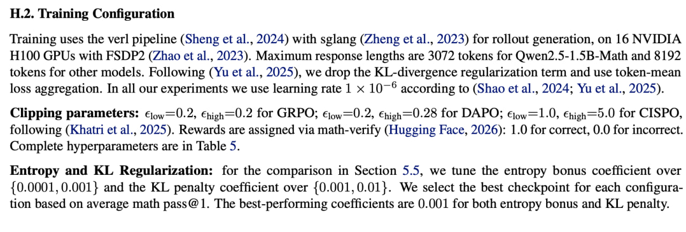
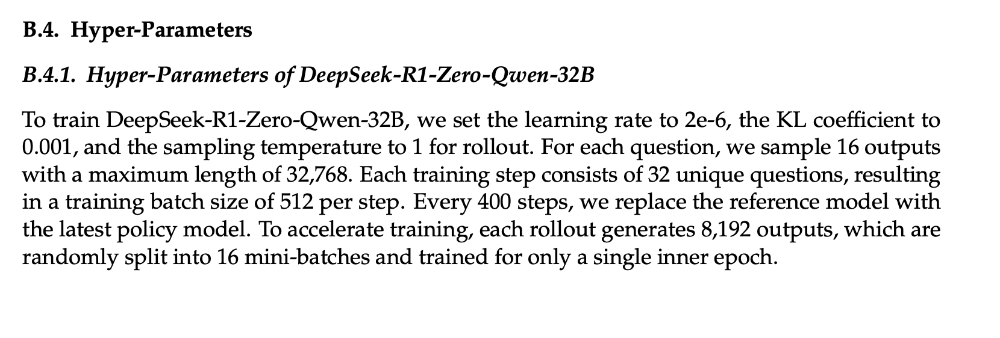
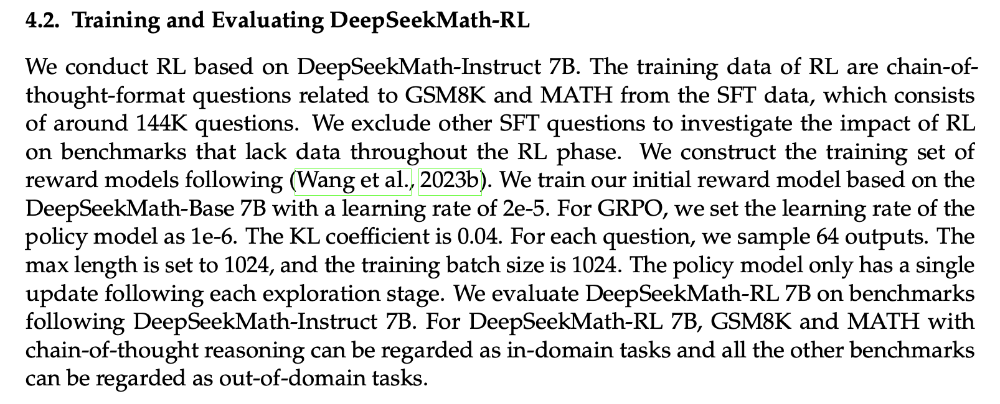
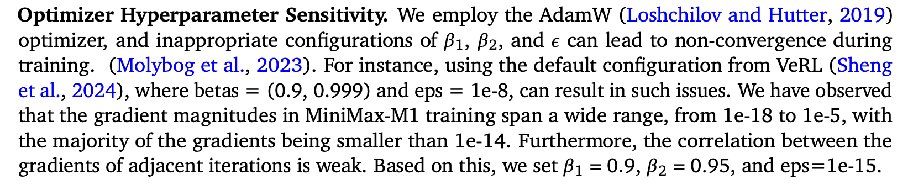
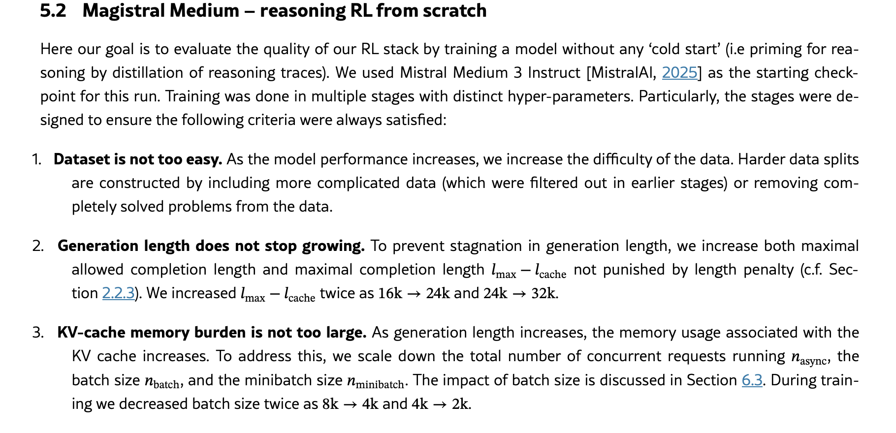
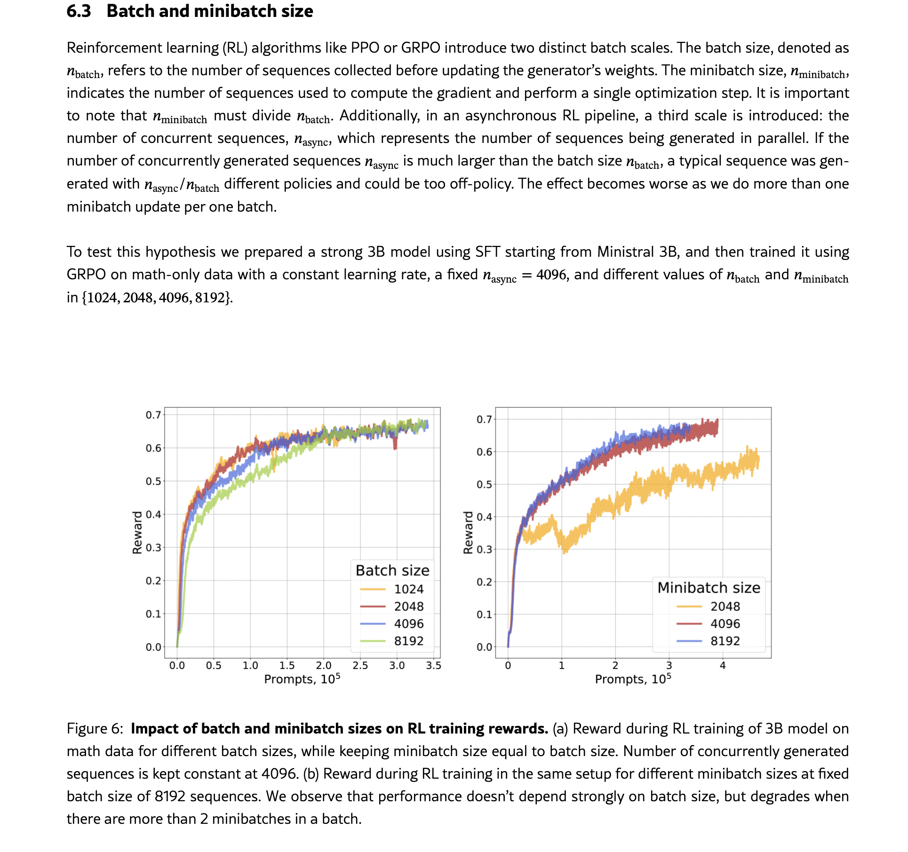
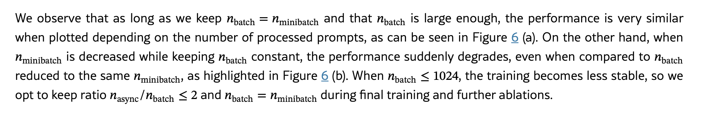
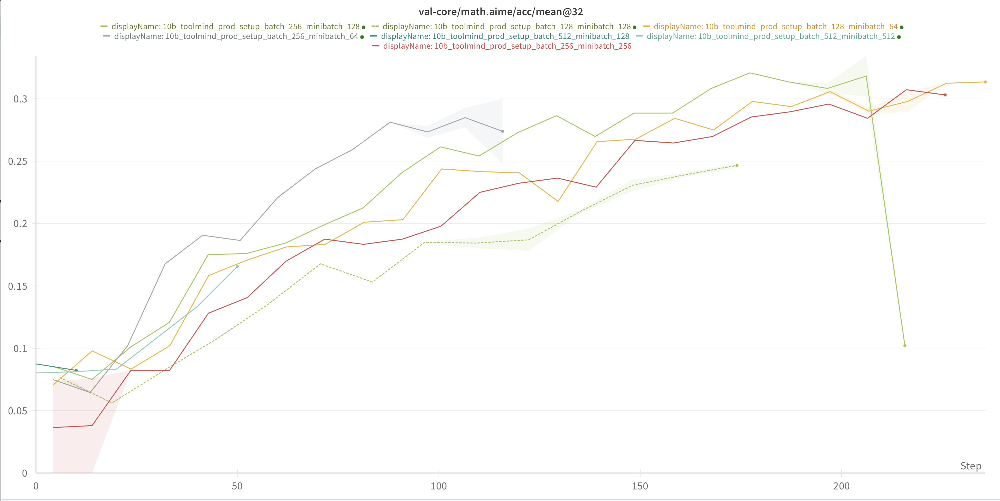

# Setups (+baseline)

## Open-source сетапы:


Олмо сетап:

 


Скайвокр сетап:

 

* Фильтр групп врублен


\
Дипсик сетап (маленькие модельки): <https://arxiv.org/pdf/2402.03300> (7b-math старая)

```javascript
We conduct RL based on DeepSeekMath-Instruct 7B. The training data of RL are chain-of-
thought-format questions related to GSM8K and MATH from the SFT data, which consists
of around 144K questions. We exclude other SFT questions to investigate the impact of RL
on benchmarks that lack data throughout the RL phase. We construct the training set of
reward models following (Wang et al., 2023b). We train our initial reward model based on the
DeepSeekMath-Base 7B with a learning rate of 2e-5. 

! For GRPO, we set the learning rate of the
policy model as 1e-6. The KL coefficient is 0.04. For each question, we sample 64 outputs. The
max length is set to 1024, and the training batch size is 1024. The policy model only has a single
update following each exploration stage. We evaluate DeepSeekMath-RL 7B on benchmarks
following DeepSeekMath-Instruct 7B. For DeepSeekMath-RL 7B, GSM8K and MATH with
chain-of-thought reasoning can be regarded as out-of-domain tasks.
```


Qwen2.5 30B (MoE?) - <https://arxiv.org/pdf/2503.14476>

```javascript
algorithm: DAPO 

batchsize: 512
minibatch size: 512
lr: 1e-6
max_response_len: 16k + 4k cache(?) = 20k
masks: NR
n_resp_per_prompt: 16

overlong: True (overlong shaping)
sampler: Dynamic sampling (?)
clip ratio: 0.2-0.28
weight_decay: ? AdamW (скорее всего 0.01)
lr warmup: 20
entropy_coeff: NR
use kl: False
grad_clip: NR
```


F-GRPO: <https://arxiv.org/pdf/2602.06717>

Возможно не совсем релевантно, однако они сравнивали с GRPO/CISPO и вроде бы описали гиперпараметры:

```javascript
2. Qwen2.5 7B/1.5B-Math, Llama-3.2 3B-Instruct (MoE?)
algorithm: F-GRPO

batchsize: 256
minibatch size: 64
lr: 1e-6 (constant scheduler)
max_response_len: ?
masks: NR
n_resp_per_prompt: ?

overlong: ?
sampler: Dynamic sampling (?)
clip ratio: ?
weight_decay: 0.01
lr warmup: 15
entropy_coeff: NR
use kl: False
grad_clip: 1.0
```


 


DeepSeek R1 - <https://arxiv.org/pdf/2501.12948>

 

```javascript
3. DeepSeek R1 (MoE?)
algorithm: 

batchsize: 512
minibatch size: ?
lr: 2e-6 
max_response_len: 32k ?
masks: NR
n_resp_per_prompt: 16

overlong: ?
sampler: 
clip ratio: ?
weight_decay: 
lr warmup: 
entropy_coeff: NR
use kl: 0.001
grad_clip: 
```


DeepSeek-Math - <https://arxiv.org/pdf/2402.03300>

 

```javascript
3. DeepSeek-Math (MoE?)
algorithm: GRPO

batchsize: 1024
minibatch size: policy model single update -> 1024
lr: 1e-6 
max_response_len: 1024 ? не совсем понял
masks: NR
n_resp_per_prompt: 64?

overlong: ?
sampler: 
clip ratio: ?
weight_decay: 
lr warmup: 
entropy_coeff: NR
use kl: 0.04
grad_clip: 
```


MiniMax-M1 - <https://arxiv.org/pdf/2506.13585>

 

Статья про Адам: <https://arxiv.org/pdf/1711.05101>

16 updates per batch (больше не нашёл)


Mistral:

 

 

 


## Доп штуки, которые у нас есть:


TODO: расписать про маски, шедулер (что-то еще?)


\
## Эксперименты:


1. Сетап:

```javascript
model: stage 1.5
loss_mode: cispo_masked
batchsize = 256
minibatch size = 256
max_response_len = 16k
lr = 1e-6
lr warmup = 25
mask = 0.5
n_resp_per_prompt=16
grad_clip = 1.0
clip_low = 0.2
clip_high = 0.28
entropy_coeff = 0
use kl = False
overlong = False
sampler: random
weight_decay = 0.1
```

<http://wandb.su:8081/alignment/scheduler-tests/runs/d44qt3u0?nw=nwuserolyandrevn> (0-50)

<http://wandb.su:8081/alignment/scheduler-tests/runs/1drqmqlg?nw=nwuserolyandrevn> (50-160)

Комментарий: развал примерно на 150-160 степе, пиковые math_500 около 0.859, aime около 0.233


2\. Сетап:

```javascript
model: stage 1.5
loss_mode: cispo_masked
batchsize = 256
minibatch size = 256
max_response_len = 16k
lr = 1e-6
lr warmup = 100
mask = 0.5
n_resp_per_prompt=16
grad_clip = 1.0
clip_low = 0.2
clip_high = 0.28
entropy_coeff = 0
use kl = False
overlong = False
sampler: random
weight_decay = 0.1
```

<http://wandb.su:8081/alignment/scheduler-tests/runs/xw2r5wgl?nw=nwuserolyandrevn> (0-220)

Комментарий: развал примерно на 200 степе, пиковые math_500 около 0.866, aime около 0.233 - warmup чуть продлил жизнь


3\. Сетап:

```javascript
model: stage 1.5
loss_mode: cispo_masked
batchsize = 128
minibatch size = 128
max_response_len = 16k
lr = 1e-6
lr warmup = 25
mask = 0.5
n_resp_per_prompt=16
grad_clip = 1.0
clip_low = 0.2
clip_high = 0.28
entropy_coeff = 0
use kl = False
overlong = False
sampler: random
weight_decay = 0.1
```

<http://wandb.su:8081/alignment/scheduler-tests/runs/abyj4cbt?nw=nwuserolyandrevn> (0-50)

<http://wandb.su:8081/alignment/scheduler-tests/runs/kpmaau0a?nw=nwuserolyandrevn> (50-150)

<http://wandb.su:8081/alignment/scheduler-tests/runs/5fb33jho?nw=nwuserolyandrevn> (150-230)

Комментарий: развал примерно на 200 степе, пиковые math_500 около 0.873, AIME около 0.238


4\. Сетапы:

аналогичные 1-2, но loss_mode - vanilla, cispo_prod → CISPO_prod стабильнее и лучше

5\. Сетапы:

аналогичные, но с контекстом 32к → слишком долго учатся

6\. Сетап:

```javascript
model: stage 1.5
loss_mode: cispo_prod
batchsize = 256
minibatch size = 256
max_response_len = 8k
lr = 1e-6
lr warmup = 25
mask = 0.5
n_resp_per_prompt=16
grad_clip = 1.0
clip_low = 0.2
clip_high = 0.28
entropy_coeff = 0
use kl = False
overlong = False
sampler: random
weight_decay = 0.1
```

<http://wandb.su:8081/alignment/scheduler-tests/runs/vqhqsuec?nw=nwuserolyandrevn> (0-160)

<http://wandb.su:8081/alignment/scheduler-tests/runs/cqxvtrwx?nw=nwuserolyandrevn> (100-190)

комментарий: первый эксперт аналогично развалился до 150 степа даже пораньше, второй экспериментов переставлен с entropy_coeff = 5e-4 и продлил жизнь

7\. Сетап:

```javascript
model: toolmind
loss_mode: cispo_prod
batchsize = 256
minibatch size = 256
max_response_len = 8k
lr = 1e-6
lr warmup = 25
mask = 0.5
n_resp_per_prompt=16
grad_clip = 1.0
clip_low = 0.2
clip_high = 0.28
entropy_coeff = 0
use kl = False
overlong = False
sampler: random
weight_decay = 0.1
```


<http://wandb.su:8081/alignment/scheduler-tests/runs/a04sj36x?nw=nwuserolyandrevn> (0-240)

Дольше жил развалился (200), AIME 0.31

8\. Сетап:

```javascript
model: dpo
loss_mode: cispo_prod
batchsize = 256
minibatch size = 256
max_response_len = 8k
lr = 1e-6
lr warmup = 25
mask = 0.5
n_resp_per_prompt=16
grad_clip = 1.0
clip_low = 0.2
clip_high = 0.28
entropy_coeff = 0
use kl = False
overlong = False
sampler: random
weight_decay = 0.1
```

<http://wandb.su:8081/alignment/scheduler-tests/runs/zt1ywao8?nw=nwuserolyandrevn> (0-270)

ещё дольше прожила метрики около те же

## 

Сетап:

==Предлагаю ставить только сабмит джобы! С инф очень много грязи, ничего становится не понятно==


## Предлагаемые раунды экспериментов:

## On-policy, off-policy и batch_size, mini_batch_size


1. Зафиксируем все гиперпараметры (как бейзлайн), будем менять только batch size/minibatch size (прод-сетап, бейзлайн с нашим сетапом 128/16 я так понимаю уже бежит):

```javascript
=====EXP_1=====
project_name: hyperparameters_tuning
exp_name: 10b_toolmind_prod_setup_batch_256_minibatch_256
sh script: 10b.toolmind.ProdSetup.b256.mb256.sh
nnodes: 4

model: 10b_toolmind
loss_mode: cispo_prod
batchsize = 256
minibatch size = 256
max_response_len = 8k
lr = 1e-6
lr warmup = 25
mask = False
n_resp_per_prompt=16
grad_clip = 1.0
clip_low = 0.2
clip_high = 0.28
entropy_coeff = 0
use kl = False
overlong = False
sampler: random
weight_decay = 0.1
mixture:                   
  code: 0.285
  math: 0.285
  structured_output: 0.01
  mcqa: 0.09
  nemotron: 0.33
```

```javascript
=====EXP_2=====
project_name: hyperparameters_tuning
exp_name: 10b_toolmind_prod_setup_batch_256_minibatch_128
sh script: 10b.toolmind.ProdSetup.b256.mb128.sh
nnodes: 4

model: 10b_toolmind
loss_mode: cispo_prod
batchsize = 256
minibatch size = 128
max_response_len = 8k
lr = 1e-6
lr warmup = 25
mask = False
n_resp_per_prompt=16
grad_clip = 1.0
clip_low = 0.2
clip_high = 0.28
entropy_coeff = 0
use kl = False
overlong = False
sampler: random
weight_decay = 0.1
mixture:                   
  code: 0.285
  math: 0.285
  structured_output: 0.01
  mcqa: 0.09
  nemotron: 0.33
```

```javascript
=====EXP_3=====
project_name: hyperparameters_tuning
exp_name: 10b_toolmind_prod_setup_batch_256_minibatch_64
sh script: 10b.toolmind.ProdSetup.b256.mb64.sh
nnodes: 4

model: 10b_toolmind
loss_mode: cispo_prod
batchsize = 256
minibatch size = 64
max_response_len = 8k
lr = 1e-6
lr warmup = 25
mask = False
n_resp_per_prompt=16
grad_clip = 1.0
clip_low = 0.2
clip_high = 0.28
entropy_coeff = 0
use kl = False
overlong = False
sampler: random
weight_decay = 0.1
mixture:                   
  code: 0.285
  math: 0.285
  structured_output: 0.01
  mcqa: 0.09
  nemotron: 0.33
```

```javascript
=====EXP_4=====
project_name: hyperparameters_tuning
exp_name: 10b_toolmind_prod_setup_batch_128_minibatch_128
sh script: 10b.toolmind.ProdSetup.b128.mb128.sh
nnodes: 4

model: 10b_toolmind
loss_mode: cispo_prod
batchsize = 128
minibatch size = 128
max_response_len = 8k
lr = 1e-6
lr warmup = 25
mask = False
n_resp_per_prompt=16
grad_clip = 1.0
clip_low = 0.2
clip_high = 0.28
entropy_coeff = 0
use kl = False
overlong = False
sampler: random
weight_decay = 0.1
mixture:                   
  code: 0.285
  math: 0.285
  structured_output: 0.01
  mcqa: 0.09
  nemotron: 0.33
```

```javascript
=====EXP_5=====
project_name: hyperparameters_tuning
exp_name: 10b_toolmind_prod_setup_batch_128_minibatch_64
sh script: 10b.toolmind.ProdSetup.b128.mb64.sh
nnodes: 4

model: 10b_toolmind
loss_mode: cispo_prod
batchsize = 128
minibatch size = 64
max_response_len = 8k
lr = 1e-6
lr warmup = 25
mask = False
n_resp_per_prompt=16
grad_clip = 1.0
clip_low = 0.2
clip_high = 0.28
entropy_coeff = 0
use kl = False
overlong = False
sampler: random
weight_decay = 0.1
mixture:                   
  code: 0.285
  math: 0.285
  structured_output: 0.01
  mcqa: 0.09
  nemotron: 0.33
```

```javascript
=====EXP_6=====
project_name: hyperparameters_tuning
exp_name: 10b_toolmind_prod_setup_batch_512_minibatch_512
sh script: 10b.toolmind.ProdSetup.b512.mb512.sh
nnodes: 4

model: 10b_toolmind
loss_mode: cispo_prod
batchsize = 512
minibatch size = 512
max_response_len = 8k
lr = 1e-6
lr warmup = 25
mask = False
n_resp_per_prompt=16
grad_clip = 1.0
clip_low = 0.2
clip_high = 0.28
entropy_coeff = 0
use kl = False
overlong = False
sampler: random
weight_decay = 0.1
mixture:                   
  code: 0.285
  math: 0.285
  structured_output: 0.01
  mcqa: 0.09
  nemotron: 0.33
```

```javascript
=====EXP_7=====
project_name: hyperparameters_tuning
exp_name: 10b_toolmind_prod_setup_batch_512_minibatch_256
sh script: 10b.toolmind.ProdSetup.b512.mb256.sh
nnodes: 4

model: 10b_toolmind
loss_mode: cispo_prod
batchsize = 512
minibatch size = 256
max_response_len = 8k
lr = 1e-6
lr warmup = 25
mask = False
n_resp_per_prompt=16
grad_clip = 1.0
clip_low = 0.2
clip_high = 0.28
entropy_coeff = 0
use kl = False
overlong = False
sampler: random
weight_decay = 0.1
mixture:                   
  code: 0.285
  math: 0.285
  structured_output: 0.01
  mcqa: 0.09
  nemotron: 0.33
```

```javascript
=====EXP_8=====
project_name: hyperparameters_tuning
exp_name: 10b_toolmind_prod_setup_batch_512_minibatch_128
sh script: 10b.toolmind.ProdSetup.b512.mb128.sh
nnodes: 4

model: 10b_toolmind
loss_mode: cispo_prod
batchsize = 512
minibatch size = 128
max_response_len = 8k
lr = 1e-6
lr warmup = 25
mask = False
n_resp_per_prompt=16
grad_clip = 1.0
clip_low = 0.2
clip_high = 0.28
entropy_coeff = 0
use kl = False
overlong = False
sampler: random
weight_decay = 0.1
mixture:                   
  code: 0.285
  math: 0.285
  structured_output: 0.01
  mcqa: 0.09
  nemotron: 0.33
```


С батчем 512 если будут карты


### Промежуточные выводы:


 

Сразу видно, что эксперименты с патчем 512 идут крайне долго, поэтому мне кажется эти сетапы можно сразу отметать, поскольку качество они дают не больше остальных сетапов. 

 

Что касается стабильности - сетап 256/128 быстро развалился, при этом энтропия сетапа 256/64 тоже агрессивно падает вниз - тоже не очень стабильно. Поэтому эти два сетапа думаю тоже можно отметать. 

 Что касается качества - в целом сильной разницы нет. Стоит отметить, что сетап 128/128 идёт медленнее с точки зрения степов (не с точки зрения пройденных семплов) - поэтому именно в плане времени эффективнее использовать более агрессивные сетапы, а не ждать тех же метрик на валидации, но за большее количество степов. 


Таким образом, по моему мнению основные кандидаты для бейзлайна - 256/256 и 128/64. Остальные по совокупности стабильности, скорости и качества как будто бы уступают этим двум сетапам. 


### Предложение по следующей итерации экспериментов: bsz = 128, minbsz = 64

1\. Оставить выбранным сетап батчей как бейзлайн - затем перед развалом запустить его с 16к контекста. 

2\. Запустить эксперимент сразу с 16к контекста. 

3\. Запустить на выбранном сетапе батчей 2 эксперимента с разными значениями масок - 0.5 и 1.0. 

4\. ~~Запустить эксперимент с weight decay = 0.01.~~ 

5\. Запустить эксперимент с cosine lr scehduler + экспы с числом эпох. 

6\. ~~2-4 эксперимента с семплером (сколько останется карт).~~ 

Почему параллельно разные гиперпараметры - как будто бы они только дополняют друг друга, поэтому можно запустить сразу разные варианты и потом агрегировать в один лучший сетап. 

```javascript
=====EXP_1=====
project_name: hyperparameters_tuning
exp_name: 10b_toolmind_prod_setup_batch_128_minibatch_64
sh script: 10b.toolmind.ProdSetup.b128.mb64.sh
nnodes: 4

model: 10b_toolmind
loss_mode: cispo_prod
batchsize = 128
minibatch size = 64
max_response_len = 8k -> 16k
lr = 1e-6
lr warmup = 25
mask = False
n_resp_per_prompt=16
grad_clip = 1.0
clip_low = 0.2
clip_high = 0.28
entropy_coeff = 0
use kl = False
overlong = False
sampler: random
weight_decay = 0.1
mixture:                   
  code: 0.285
  math: 0.285
  structured_output: 0.01
  mcqa: 0.09
  nemotron: 0.33
```

```javascript
=====EXP_2=====
project_name: hyperparameters_tuning
exp_name: CISPO-10b_toolmind_prod_setup_batch_128_minibatch_64_context_16k
sh script: 10b.toolmind.ProdSetup.b128.mb64.c16k.sh
nnodes: 4

model: 10b_toolmind
loss_mode: cispo_prod
batchsize = ?
minibatch size = ?
max_response_len = 16k
lr = 1e-6
lr warmup = 25
mask = False
n_resp_per_prompt=16
grad_clip = 1.0
clip_low = 0.2
clip_high = 0.28
entropy_coeff = 0
use kl = False
overlong = False
sampler: random
weight_decay = 0.1
mixture:                   
  code: 0.285
  math: 0.285
  structured_output: 0.01
  mcqa: 0.09
  nemotron: 0.33
```

```javascript
=====EXP_3=====
project_name: hyperparameters_tuning
exp_name: CISPO_MASKED-10b_toolmind_prod_setup_batch_128_minibatch_64_mask_05_context_8k
sh script: 10b.toolmind.ProdSetup.b128.mb64.c8k.m05.sh
nnodes: 4

model: 10b_toolmind
loss_mode: cispo_masked
batchsize = 128
minibatch size = 64
max_response_len = 8k
lr = 1e-6
lr warmup = 25
mask = 0.5
n_resp_per_prompt=16
grad_clip = 1.0
clip_low = 0.2
clip_high = 0.28
entropy_coeff = 0
use kl = False
overlong = False
sampler: random
weight_decay = 0.1
mixture:                   
  code: 0.285
  math: 0.285
  structured_output: 0.01
  mcqa: 0.09
  nemotron: 0.33
```

```javascript
=====EXP_4=====
project_name: hyperparameters_tuning
exp_name: CISPO_MASKED-10b_toolmind_prod_setup_batch_128_minibatch_64_mask10_context_8k
sh script: 10b.toolmind.ProdSetup.b128.mb64.c8k.m10.sh
nnodes: 4

model: 10b_toolmind
loss_mode: cispo_masked
batchsize = 128
minibatch size = 64
max_response_len = 8k -> 16k
lr = 1e-6
lr warmup = 25
mask = 1.0
n_resp_per_prompt=16
grad_clip = 1.0
clip_low = 0.2
clip_high = 0.28
entropy_coeff = 0
use kl = False
overlong = False
sampler: random
weight_decay = 0.1
mixture:                   
  code: 0.285
  math: 0.285
  structured_output: 0.01
  mcqa: 0.09
  nemotron: 0.33
```

```javascript
=====LR_SCHEDULER_EXPS=====
```

```javascript
=====EXP_7,8,9+=====
default math setup + разные гиперпараметры семплера
как только будет лучший - запуск в прод сетапе
```


===============================================================================

(На будущее с семплерами): (Под вопросом)

```javascript
=====EXP_X1=====
model: 10b_toolmind
loss_mode: cispo_prod
batchsize = 256
minibatch size = 256
max_response_len = 8k
lr = 1e-6
lr warmup = 25
mask = False
n_resp_per_prompt=16
grad_clip = 1.0
clip_low = 0.2
clip_high = 0.28
entropy_coeff = 0
use kl = False
overlong = False
sampler: advantage (setup 2)
weight_decay = 0.1
mixture:                   
  code: 0.285
  math: 0.285
  structured_output: 0.01
  mcqa: 0.09
  nemotron: 0.33
```

```javascript
=====EXP_X2=====
model: 10b_toolmind
loss_mode: cispo_prod
batchsize = 256
minibatch size = 256
max_response_len = 8k
lr = 1e-6
lr warmup = 25
mask = False
n_resp_per_prompt=16
grad_clip = 1.0
clip_low = 0.2
clip_high = 0.28
entropy_coeff = 0
use kl = False
overlong = False
sampler: advantage (setup 3)
weight_decay = 0.1
mixture:                   
  code: 0.285
  math: 0.285
  structured_output: 0.01
  mcqa: 0.09
  nemotron: 0.33
```

```javascript
=====EXP_X3=====
model: 10b_toolmind
loss_mode: cispo_prod
batchsize = 256
minibatch size = 256
max_response_len = 8k
lr = 1e-6
lr warmup = 25
mask = False
n_resp_per_prompt=16
grad_clip = 1.0
clip_low = 0.2
clip_high = 0.28
entropy_coeff = 0
use kl = False
overlong = False
sampler: advantage (setup 4)
weight_decay = 0.1
mixture:                   
  code: 0.285
  math: 0.285
  structured_output: 0.01
  mcqa: 0.09
  nemotron: 0.33
```


EXP_9 - быстрый только на математике, чтобы быстро проверить семплер

```javascript
=====EXP_9=====
model: 10b_toolmind
loss_mode: cispo_masked
batchsize = 256
minibatch size = 256
max_response_len = 8k
lr = 1e-6
lr warmup = 25
mask = 0.5
n_resp_per_prompt=16
grad_clip = 1.0
clip_low = 0.2
clip_high = 0.28
entropy_coeff = 0
use kl = False
overlong = False
sampler: advantage (setup 1)
weight_decay = 0.1
```


Возможно можно ешь с разным контекстом и Адамом запустить, но только если будут карты. 


(Нужно быстро проверить, что семплер даёт прирост, хотя это конечно сложновато сделать с не подобранными гиперпараметрами - в идеале 2-3 эксперимента)


В зависимости от карт - это предлагаемые эксперименты на выходные, почему:

* Важно сразу зафиксировать бейзлайн сетап относительно размеров матчей (on-policy vs off-policy) - только после этого подбирать остальной сетап, потому что остальные гиперпараметры зависят от размеров батчей и режима обучения (пример: clip_ratio не нужен при on-policy сетапе и наоборот, нужен для off-policy, примерно то же самое и с остальными). 
* Важно его зафиксировать быстро, поэтому max_response_len = 8k (иначе обучение будет идти дольше). 


2. После того, как определимся с режимом обучения подбирать другие, но я бы также подобрал бы следующее (что не очень зависит от батчей):

* weight_decay: сейчас 0.1, однако в статьях, что я успел посмотреть, ссылаются на эту статью: <https://arxiv.org/pdf/1711.05101> (сюда же <https://arxiv.org/pdf/2512.16144>).  После чего выбирают weight_decay = 0.01 (также другие параметры для Адама, надо посмотреть, какие стоят у нас, и возможно поставить дефолт как у всех примерно). 
* max_response_len: 8k/16k/scheduler: сначала 8k, потом увеличивать. 
* (?) lr scheduler, sampler. 


3\. Уже потом переходить к остальным гиперпараметрам, поскольку они зависимы от первых. 


\
Итого: 32\*9 = 288 карт.  

Всего - около 800, так что можно сразу поставить эксперименты с длиной контекста и weight_decay - это ещё 


## Response len

Во многих сетапах ставят 16k (где-то и 32k), кажется, это должно повышать метрики (возможно, это может стабилизировать обучение, есть мысли почему), поэтому на найденном батче и мини-батче с лром хочется проверить 8k и 16k длины, как что будет себя вести


```javascript
=====EXP_2.1=====
project_name: hyperparameters_tuning
exp_name: 10b_toolmind_prod_setup_batch_?_minibatch_?_resposne_len_8k
sh script: 10b.toolmind.ProdSetup.?.?.sh
nnodes: 4

model: 10b_toolmind
loss_mode: cispo_prod
batchsize = ?
minibatch size = ?
max_response_len = 8 * 1024
lr = 1e-6
lr warmup = 25
mask = False
n_resp_per_prompt=16
grad_clip = 1.0
clip_low = 0.2
clip_high = 0.28
entropy_coeff = 0
use kl = False
overlong = False
sampler: random
weight_decay = 0.1
mixture:                   
  code: 0.285
  math: 0.285
  structured_output: 0.01
  mcqa: 0.09
  nemotron: 0.33
```

```javascript
=====EXP_2.2=====
project_name: hyperparameters_tuning
exp_name: 10b_toolmind_prod_setup_batch_?_minibatch_?_resposne_len_16k
sh script: 10b.toolmind.ProdSetup.?.?.sh
nnodes: 4

model: 10b_toolmind
loss_mode: cispo_prod
batchsize = ?
minibatch size = ?
max_response_len = 16 * 1024
lr = 1e-6
lr warmup = 25
mask = False
n_resp_per_prompt=16
grad_clip = 1.0
clip_low = 0.2
clip_high = 0.28
entropy_coeff = 0
use kl = False
overlong = False
sampler: random
weight_decay = 0.1
mixture:                   
  code: 0.285
  math: 0.285
  structured_output: 0.01
  mcqa: 0.09
  nemotron: 0.33
```