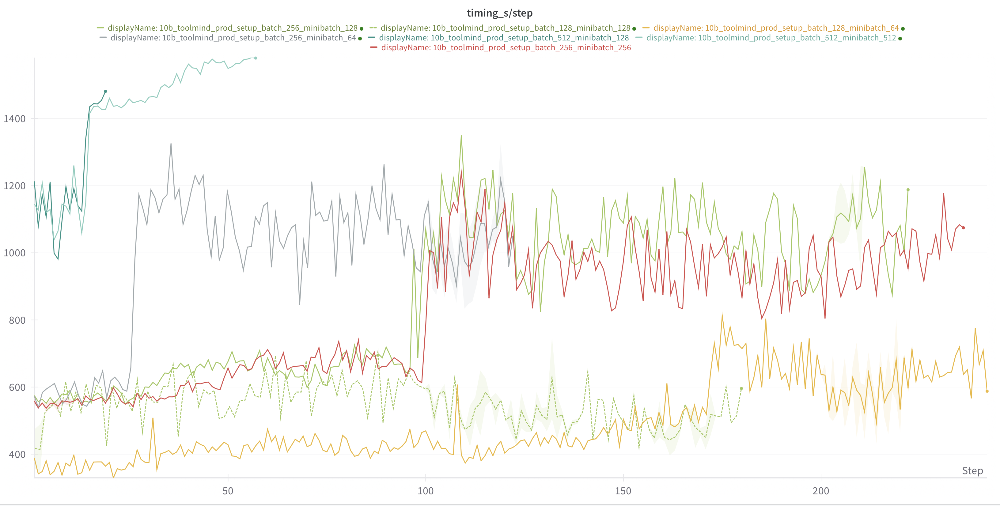
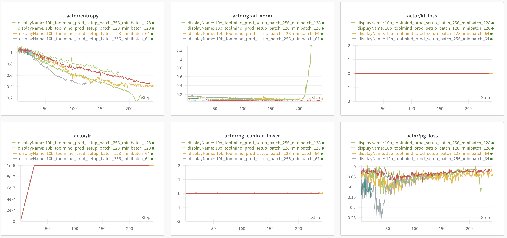

# Round 1

## On-policy, off-policy и batch_size, mini_batch_size


1. Зафиксируем все гиперпараметры (как бейзлайн), будем менять только batch size/minibatch size (прод-сетап, бейзлайн с нашим сетапом 128/16 я так понимаю уже бежит):

```javascript
=====EXP_1=====
project_name: hyperparameters_tuning
exp_name: 10b_toolmind_prod_setup_batch_256_minibatch_256
sh script: 10b.toolmind.ProdSetup.b256.mb256.sh
nnodes: 4

model: 10b_toolmind
loss_mode: cispo_prod
batchsize = 256
minibatch size = 256
max_response_len = 8k
lr = 1e-6
lr warmup = 25
mask = False
n_resp_per_prompt=16
grad_clip = 1.0
clip_low = 0.2
clip_high = 0.28
entropy_coeff = 0
use kl = False
overlong = False
sampler: random
weight_decay = 0.1
mixture:                   
  code: 0.285
  math: 0.285
  structured_output: 0.01
  mcqa: 0.09
  nemotron: 0.33
```

```javascript
=====EXP_2=====
project_name: hyperparameters_tuning
exp_name: 10b_toolmind_prod_setup_batch_256_minibatch_128
sh script: 10b.toolmind.ProdSetup.b256.mb128.sh
nnodes: 4

model: 10b_toolmind
loss_mode: cispo_prod
batchsize = 256
minibatch size = 128
max_response_len = 8k
lr = 1e-6
lr warmup = 25
mask = False
n_resp_per_prompt=16
grad_clip = 1.0
clip_low = 0.2
clip_high = 0.28
entropy_coeff = 0
use kl = False
overlong = False
sampler: random
weight_decay = 0.1
mixture:                   
  code: 0.285
  math: 0.285
  structured_output: 0.01
  mcqa: 0.09
  nemotron: 0.33
```

```javascript
=====EXP_3=====
project_name: hyperparameters_tuning
exp_name: 10b_toolmind_prod_setup_batch_256_minibatch_64
sh script: 10b.toolmind.ProdSetup.b256.mb64.sh
nnodes: 4

model: 10b_toolmind
loss_mode: cispo_prod
batchsize = 256
minibatch size = 64
max_response_len = 8k
lr = 1e-6
lr warmup = 25
mask = False
n_resp_per_prompt=16
grad_clip = 1.0
clip_low = 0.2
clip_high = 0.28
entropy_coeff = 0
use kl = False
overlong = False
sampler: random
weight_decay = 0.1
mixture:                   
  code: 0.285
  math: 0.285
  structured_output: 0.01
  mcqa: 0.09
  nemotron: 0.33
```

```javascript
=====EXP_4=====
project_name: hyperparameters_tuning
exp_name: 10b_toolmind_prod_setup_batch_128_minibatch_128
sh script: 10b.toolmind.ProdSetup.b128.mb128.sh
nnodes: 4

model: 10b_toolmind
loss_mode: cispo_prod
batchsize = 128
minibatch size = 128
max_response_len = 8k
lr = 1e-6
lr warmup = 25
mask = False
n_resp_per_prompt=16
grad_clip = 1.0
clip_low = 0.2
clip_high = 0.28
entropy_coeff = 0
use kl = False
overlong = False
sampler: random
weight_decay = 0.1
mixture:                   
  code: 0.285
  math: 0.285
  structured_output: 0.01
  mcqa: 0.09
  nemotron: 0.33
```

```javascript
=====EXP_5=====
project_name: hyperparameters_tuning
exp_name: 10b_toolmind_prod_setup_batch_128_minibatch_64
sh script: 10b.toolmind.ProdSetup.b128.mb64.sh
nnodes: 4

model: 10b_toolmind
loss_mode: cispo_prod
batchsize = 128
minibatch size = 64
max_response_len = 8k
lr = 1e-6
lr warmup = 25
mask = False
n_resp_per_prompt=16
grad_clip = 1.0
clip_low = 0.2
clip_high = 0.28
entropy_coeff = 0
use kl = False
overlong = False
sampler: random
weight_decay = 0.1
mixture:                   
  code: 0.285
  math: 0.285
  structured_output: 0.01
  mcqa: 0.09
  nemotron: 0.33
```

```javascript
=====EXP_6=====
project_name: hyperparameters_tuning
exp_name: 10b_toolmind_prod_setup_batch_512_minibatch_512
sh script: 10b.toolmind.ProdSetup.b512.mb512.sh
nnodes: 4

model: 10b_toolmind
loss_mode: cispo_prod
batchsize = 512
minibatch size = 512
max_response_len = 8k
lr = 1e-6
lr warmup = 25
mask = False
n_resp_per_prompt=16
grad_clip = 1.0
clip_low = 0.2
clip_high = 0.28
entropy_coeff = 0
use kl = False
overlong = False
sampler: random
weight_decay = 0.1
mixture:                   
  code: 0.285
  math: 0.285
  structured_output: 0.01
  mcqa: 0.09
  nemotron: 0.33
```

```javascript
=====EXP_7=====
project_name: hyperparameters_tuning
exp_name: 10b_toolmind_prod_setup_batch_512_minibatch_256
sh script: 10b.toolmind.ProdSetup.b512.mb256.sh
nnodes: 4

model: 10b_toolmind
loss_mode: cispo_prod
batchsize = 512
minibatch size = 256
max_response_len = 8k
lr = 1e-6
lr warmup = 25
mask = False
n_resp_per_prompt=16
grad_clip = 1.0
clip_low = 0.2
clip_high = 0.28
entropy_coeff = 0
use kl = False
overlong = False
sampler: random
weight_decay = 0.1
mixture:                   
  code: 0.285
  math: 0.285
  structured_output: 0.01
  mcqa: 0.09
  nemotron: 0.33
```

```javascript
=====EXP_8=====
project_name: hyperparameters_tuning
exp_name: 10b_toolmind_prod_setup_batch_512_minibatch_128
sh script: 10b.toolmind.ProdSetup.b512.mb128.sh
nnodes: 4

model: 10b_toolmind
loss_mode: cispo_prod
batchsize = 512
minibatch size = 128
max_response_len = 8k
lr = 1e-6
lr warmup = 25
mask = False
n_resp_per_prompt=16
grad_clip = 1.0
clip_low = 0.2
clip_high = 0.28
entropy_coeff = 0
use kl = False
overlong = False
sampler: random
weight_decay = 0.1
mixture:                   
  code: 0.285
  math: 0.285
  structured_output: 0.01
  mcqa: 0.09
  nemotron: 0.33
```


С батчем 512 если будут карты


### Промежуточные выводы:


\
 


Сразу видно, что эксперименты с патчем 512 идут крайне долго, поэтому мне кажется эти сетапы можно сразу отметать, поскольку качество они дают не больше остальных сетапов. 


 


Что касается стабильности - сетап 256/128 быстро развалился, при этом энтропия сетапа 256/64 тоже агрессивно падает вниз - тоже не очень стабильно. Поэтому эти два сетапа думаю тоже можно отметать. 


 Что касается качества - в целом сильной разницы нет. Стоит отметить, что сетап 128/128 идёт медленнее с точки зрения степов (не с точки зрения пройденных семплов) - поэтому именно в плане времени эффективнее использовать более агрессивные сетапы, а не ждать тех же метрик на валидации, но за большее количество степов. 


\
Таким образом, по моему мнению основные кандидаты для бейзлайна - 256/256 и 128/64. Остальные по совокупности стабильности, скорости и качества как будто бы уступают этим двум сетапам. 


#### Выбор - batchsize = 128, minibatch size = 64