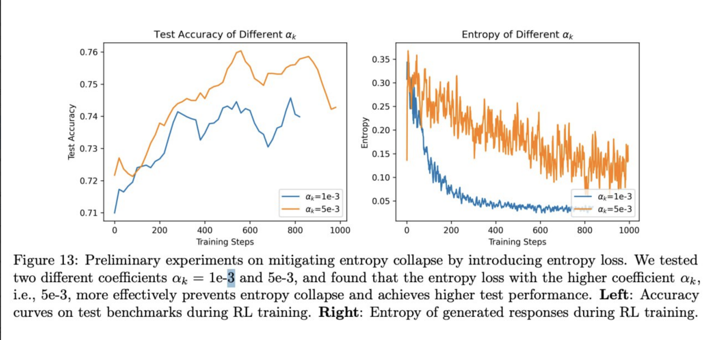
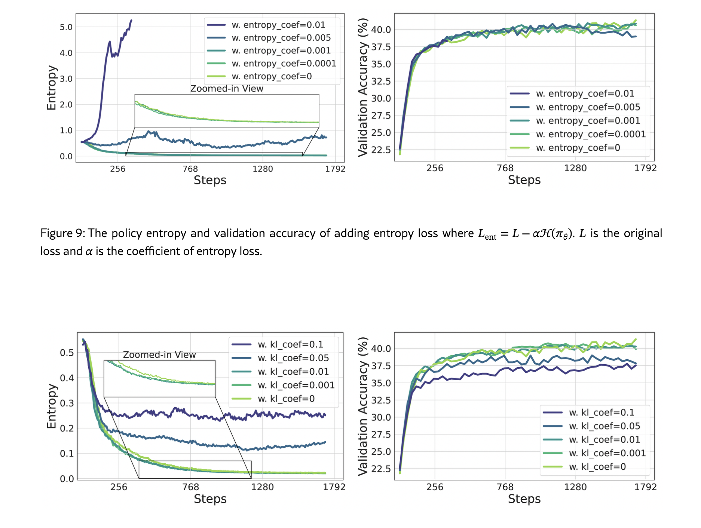

# Round 3

### Предварительная следующая итерация экспериментов:


Текущий сетап после двух раундов выглядит так:


```javascript
=====EXP=====
project_name: hyperparameters_tuning
exp_name: 10b_toolmind_prod_setup_batch_128_minibatch_64
sh script: 10b.toolmind.ProdSetup.b128.mb64.sh
nnodes: 4

model: 10b_toolmind -> 10b_cold_start ?
loss_mode: cispo_prod
batchsize = 128
minibatch size = 64
max_response_len = ? + stages ?
lr = 1e-6
lr warmup = 25
lr scheduler ?
mask = False ?
n_resp_per_prompt=16
grad_clip = 1.0
clip_low = 0.2
clip_high = 0.28
entropy_coeff = 0
use kl = False
overlong = False
sampler: random
weight_decay = 0.1
mixture:                   
  code: 0.285
  math: 0.285
  structured_output: 0.01
  mcqa: 0.09
  nemotron: 0.33
```


Что осталось проверить:

```javascript
clip_low
clip_high
entropy_coeff
use kl
n_resp_per_prompt
weight_decay
```


* clip ratio - думаю основной акцент должен быть на них. На данный момент значение - 0.2/0.28. 

Однако скорее всего это не оптимальные значения клиппинга и их стоит подобрать, в основном опираясь на эту статью, например: <https://arxiv.org/pdf/2602.06717> или статьи минимакса, в которых предлагается клипать выше. 

Стоит поставить 3 разных варианта клиппинга:

```javascript
baseline ratio:
clip_low = 0.2
clip_high = 0.28

ratio 1:
clip_low = 1.0
clip_high = 0.28

ratio 2:
clip_low = 0.2
clip_high = 4.0

ratio 3:
clip_low = 1.0
clip_high = 4.0
```

Мотивация - проверить клиппинг в разные стороны относительно наших текущих: попробовать поменять только нижний или верхний, а также поменять оба в соответствии с тем, как в разных статьях советуют ставить клипы для CISPO. 

* Думаю также стоит запустить пару экспериментов с другой advantage нормализацией (dr.grpo like):

```javascript
Exp1:
adv_normalize = False (посмотреть как это правильно задавать в верле)

Exp2:
adv_normalize = False (посмотреть как это правильно задавать в верле)
loss_agg_mode = dr_grpo (посмотреть как это правилно задавать в верле)
```

* n_resp_per_prompt - хороший вопрос возможно тоже не сейчас. 


* entropy_coeff, use kl, weight decay - сейчас мне кажется сейчас на это не хватит времени и ресурсов быстро проверить разные гипотезы (из статей итд), поскольку нужно аккуратно подбирать коэффициенты: например, 1e-4 entropy coeff не даёт никакого результата, 1e-3 уводит обучение в максимизацию энтропии, 5е-4 уже даёт какой-то стабильности (в моих экспериментах только на математике), но это всё нужно аккуратно подбирать. То же самое и со штрафом на kl. 

 

 

<https://arxiv.org/html/2505.22617v1>. 

В общем - это задача, требующая времени и аккуратности, поэтому эти гиперпараметры если и стоит смотреть, то в будущем. 


### Предварительные сетапы экспериментов:


```javascript
=====EXP_0-BASELINE=====
project_name: hyperparameters_tuning
exp_name: 10b_toolmind_prod_setup_batch_128_minibatch_64
sh script: 10b.toolmind.ProdSetup.b128.mb64.sh
nnodes: 4

model: 10b_toolmind -> 10b_cold_start ?
loss_mode: cispo_prod
batchsize = 128
minibatch size = 64
max_response_len = ? + stages ?
lr = 1e-6
lr warmup = 25
lr scheduler ?
mask = False ?
n_resp_per_prompt=16
grad_clip = 1.0
clip_low = 0.2
clip_high = 0.28
entropy_coeff = 0
use kl = False
overlong = False
sampler: random
weight_decay = 0.1
mixture:                   
  code: 0.285
  math: 0.285
  structured_output: 0.01
  mcqa: 0.09
  nemotron: 0.33
```


Первые 3 эксперимента - отличие от бейзлайна только в клиппинге:

```javascript
=====EXP_1=====
project_name: hyperparameters_tuning
exp_name: -
sh script: -
nnodes: 4

model: 10b_toolmind -> 10b_cold_start ?
loss_mode: cispo_prod
batchsize = 128
minibatch size = 64
max_response_len = ? + stages ?
lr = 1e-6
lr warmup = 25
lr scheduler ?
mask = False ?
n_resp_per_prompt=16
grad_clip = 1.0
clip_low = 1.0
clip_high = 0.28
entropy_coeff = 0
use kl = False
overlong = False
sampler: random
weight_decay = 0.1
mixture:                   
  code: 0.285
  math: 0.285
  structured_output: 0.01
  mcqa: 0.09
  nemotron: 0.33
```

```javascript
=====EXP_2=====
project_name: hyperparameters_tuning
exp_name: -
sh script: -
nnodes: 4

model: 10b_toolmind -> 10b_cold_start ?
loss_mode: cispo_prod
batchsize = 128
minibatch size = 64
max_response_len = ? + stages ?
lr = 1e-6
lr warmup = 25
lr scheduler ?
mask = False ?
n_resp_per_prompt=16
grad_clip = 1.0
clip_low = 0.2
clip_high = 4.0
entropy_coeff = 0
use kl = False
overlong = False
sampler: random
weight_decay = 0.1
mixture:                   
  code: 0.285
  math: 0.285
  structured_output: 0.01
  mcqa: 0.09
  nemotron: 0.33
```

```javascript
=====EXP_3=====
project_name: hyperparameters_tuning
exp_name: -
sh script: -
nnodes: 4

model: 10b_toolmind -> 10b_cold_start ?
loss_mode: cispo_prod
batchsize = 128
minibatch size = 64
max_response_len = ? + stages ?
lr = 1e-6
lr warmup = 25
lr scheduler ?
mask = False ?
n_resp_per_prompt=16
grad_clip = 1.0
clip_low = 1.0
clip_high = 4.0
entropy_coeff = 0
use kl = False
overlong = False
sampler: random
weight_decay = 0.1
mixture:                   
  code: 0.285
  math: 0.285
  structured_output: 0.01
  mcqa: 0.09
  nemotron: 0.33
```

Результат - определимся с clip range. 


====================================?????======================================

2 эксперимента - тест нормализации (? поскольку по-хорошему нельзя запускать эти эксперименты параллельно с клипами, иначе есть риск, что объединив идеи ничего хорошего может и не получиться). 

```javascript
=====EXP_4=====
project_name: hyperparameters_tuning
exp_name: -
sh script: -
nnodes: 4

model: 10b_toolmind -> 10b_cold_start ?
loss_mode: cispo_prod
batchsize = 128
minibatch size = 64
max_response_len = ? + stages ?
lr = 1e-6
lr warmup = 25
lr scheduler ?
mask = False ?
n_resp_per_prompt=16
grad_clip = 1.0
clip_low = 1.0
clip_high = 0.28
entropy_coeff = 0
use kl = False
overlong = False
sampler: random
weight_decay = 0.1
adv_normalize = False (посмотреть как это правильно задавать в верле)
mixture:                   
  code: 0.285
  math: 0.285
  structured_output: 0.01
  mcqa: 0.09
  nemotron: 0.33
```

```javascript
=====EXP_5=====
project_name: hyperparameters_tuning
exp_name: -
sh script: -
nnodes: 4

model: 10b_toolmind -> 10b_cold_start ?
loss_mode: cispo_prod
batchsize = 128
minibatch size = 64
max_response_len = ? + stages ?
lr = 1e-6
lr warmup = 25
lr scheduler ?
mask = False ?
n_resp_per_prompt=16
grad_clip = 1.0
clip_low = 1.0
clip_high = 0.28
entropy_coeff = 0
use kl = False
overlong = False
sampler: random
weight_decay = 0.1
adv_normalize = False (посмотреть как это правильно задавать в верле)
loss_agg_mode = dr_grpo (посмотреть как это правилно задавать в верле)
mixture:                   
  code: 0.285
  math: 0.285
  structured_output: 0.01
  mcqa: 0.09
  nemotron: 0.33
```

====================================?????======================================


Также если ставить все эксперименты с lr шедулером, думаю стоит также поставить 1-2 быстрых эксперимента без него, чтобы быстро дойти до метрик.