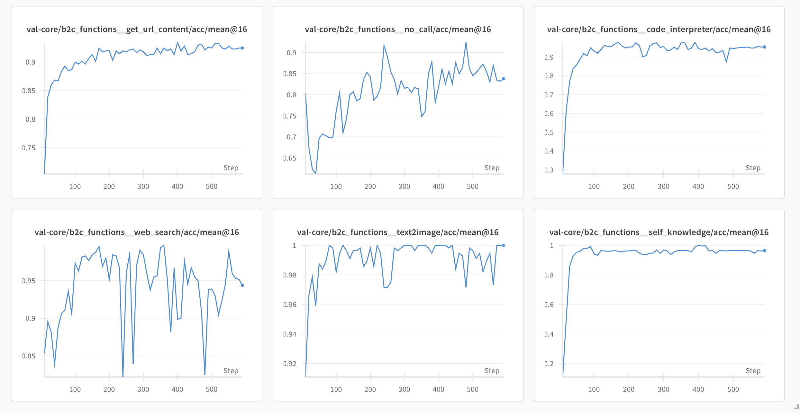
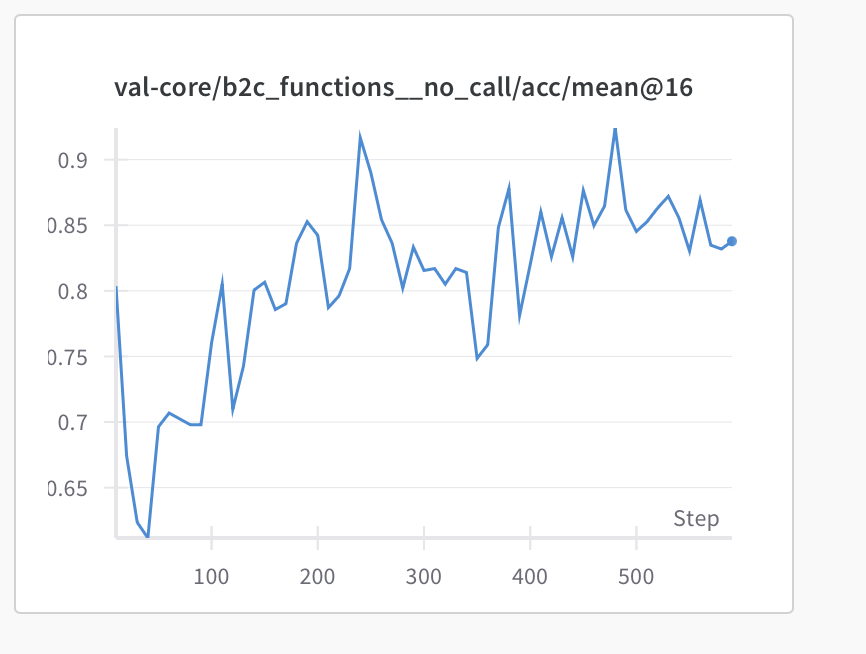

# (lproz) B2C tools

==Результаты обучения на данных b2c тулов== 

**Данные:** история + вопрос → нужный тул

\n**Тулы:** 

* get_time — возвращает текущие дату/время.

* self_knowledge — отвечает на вопросы о возможностях/свойствах ассистента.

* text2image — генерирует/редактирует изображение по текстовому описанию.

* get_url_content — получает содержимое по URL(ам).

* code interpreter
* websearch

**Результаты:** 

 

 

**Основные ошибки:**

* путает webseach <-> no_call, с этим связаны в основном downspikes у серча
* websearch <→ self_knowledge
* code_interpreter для простой математики

**Данные.** Нашла примеры no_call, когда у нас вызывался тул +- оправдано:

* Можешь показать пример простого теста юнит-тестирования на Python с использованием библиотеки unittest?

* Сгенерируй образ персонажа: гиперреалистичный куратор моделей. Опиши его стиль работы с AI, сильные и слабые стороны, любимый инструмент или фишку, и придумай смешной девиз. Сделай это с юмором и в лёгком футуристическом стиле
* Если выехать завтра утром к новому году успею?
* Это значит, что завтра выходной
* История развития о письме вклад учёных
* Как нарисовать картинку с помощью гигачат
* Картинка со словами «танцуй на всё» танцор, танец хип хоп, соревнования медаль
* Что такое отомикоз?

\
**In progress:** имплементация b2c тулов для multi-hop обучения