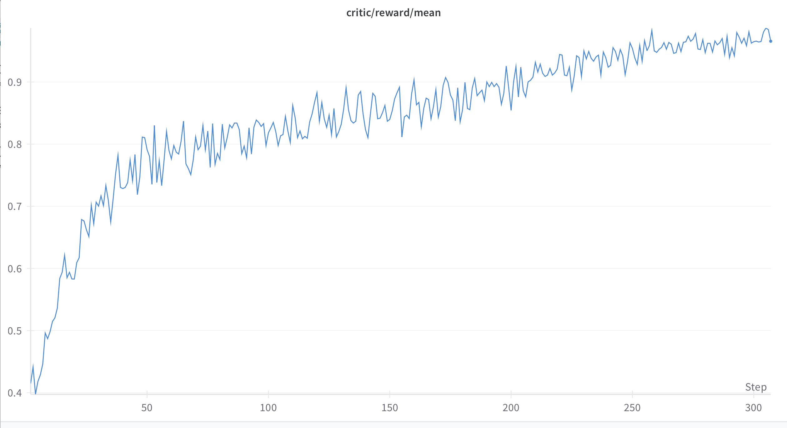
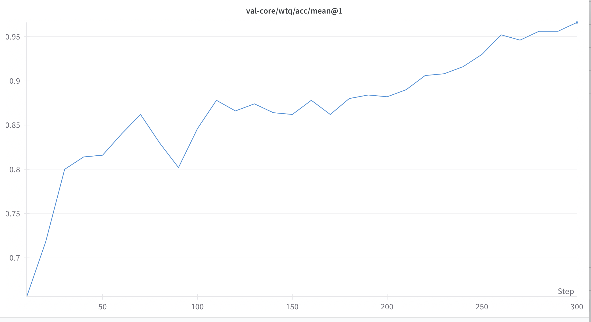

# (lproz) Get file tool

==Обучение на задачи работы с файлами (табличные и текстовые)==

**Данные:** WikiTableQuestions, WikiSQL, TabFact, FinQA, TAT-QA

\n**Задачи:** для таблиц простой look up или сгруппировать, посчитать, пофильтровать итд. Для таблиц + текстовых: выбрать нужный файл для поиска информации, увидеть тренд в данных и объяснить информацией из текстов

\n**Тулы:** get_file_content - возвращает файл текстом, code interpreter - можно считать файл в коде и анализировать\n\n**Ран:** данные WikiTableQuestions (маленькие таблицы до 70 ячеек)

 

 \n**Наблюдение:** рост есть, однако модель быстро (к \~40 степу) перестает использовать code interpreter, тк пока таблицы очень маленькие (до 70 ячеек)

\n**TO-DO:** пустить обучение на более крупных таблицах и более сложных задачах, сделать не костыльную работу с файлами в sandbox