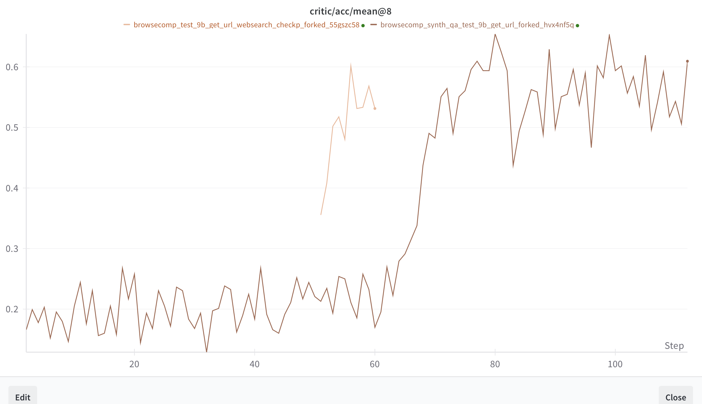
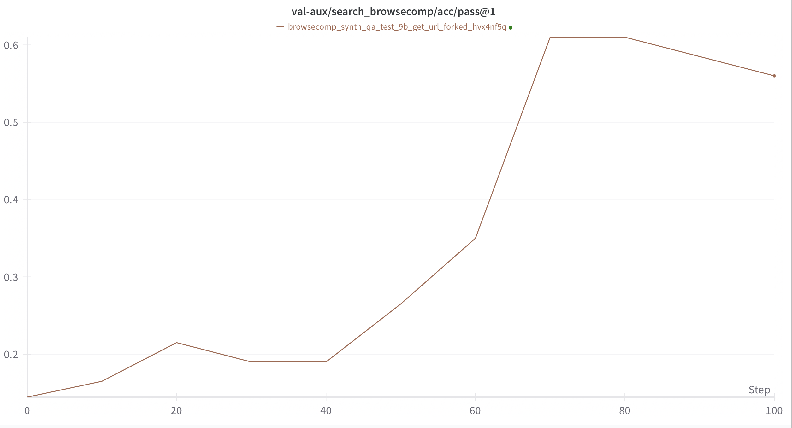
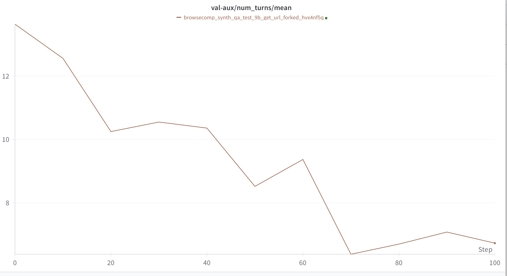
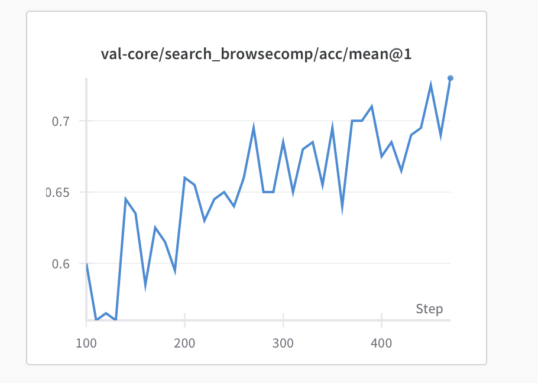

# (lproz) Browse comp

**Browse comp** - сложные задачи с multi-hop вопросами на websearch

Тесты:

* 10b toolmind 
* 9b
* 9b чекпоинт после обучения простым задачам websearch
* с использованием только websearch и c get_url_content
* с заглушкой на дублирующие вызовы websearch

Наблюдения:

* не более 5-10 качественных траектории из 1,2к
* много циклов, до 70% запросов являются дубликатами
* ожидаем что get_url_content поможет решать задачи, но пока он вызывается плохо, 95% "придуманных" ссылок
* после обучения websearch циклит меньше и меньше выдумывает ссылки

Синтетические данные (более простые)

* решается на 14.5%
* сохраняется проблема с циклами и get_url

Запустили обучение:

 

  Также падает num_turns/mean, что может говорить об уменьшении числа циклов

Обучение на синте:

 

\