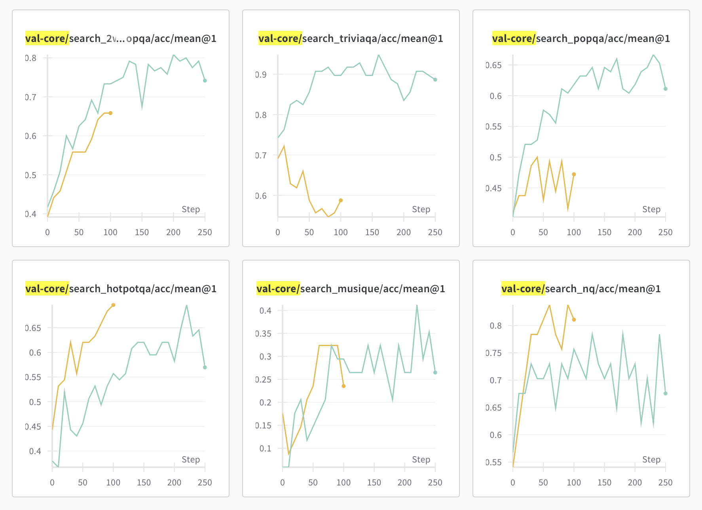
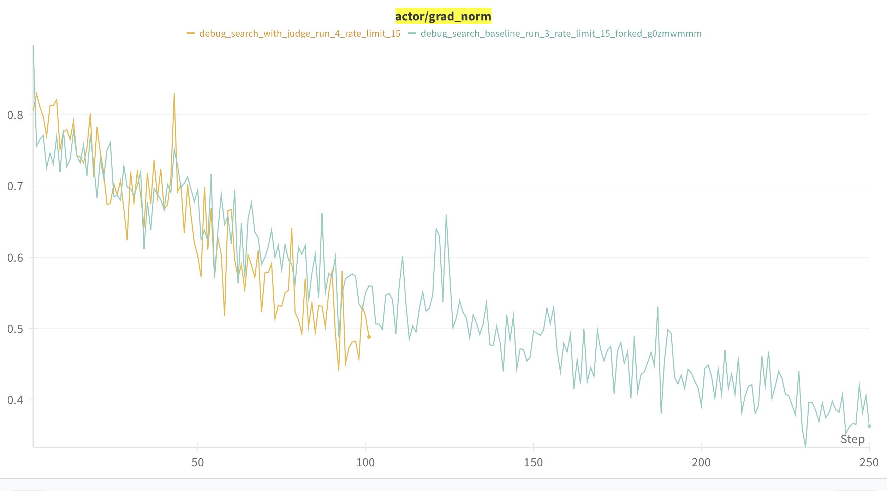
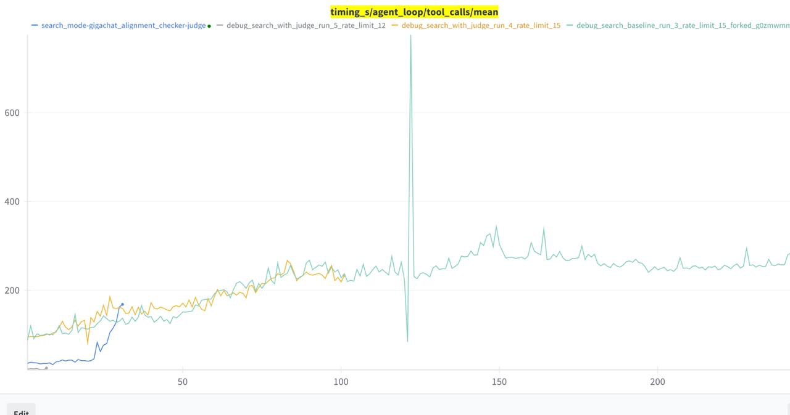
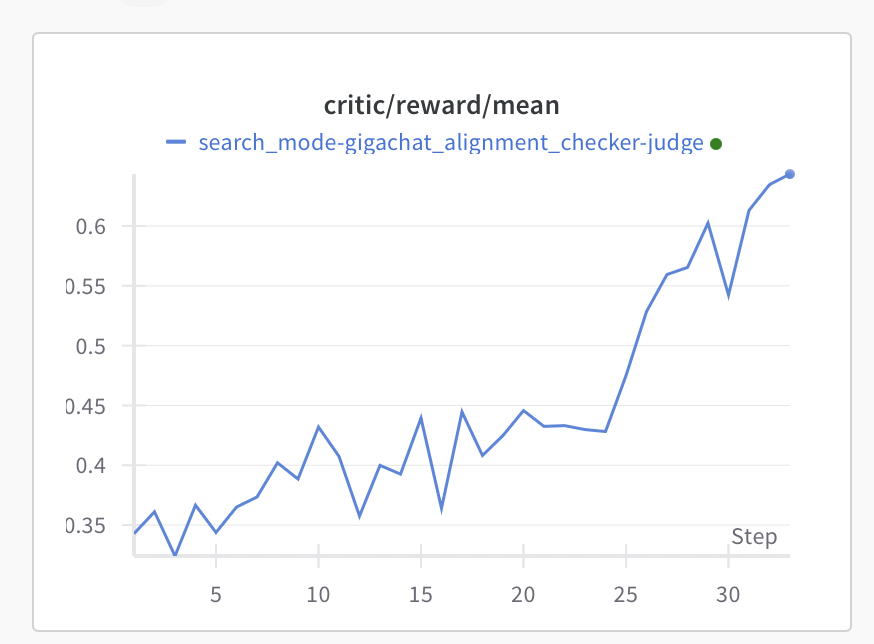
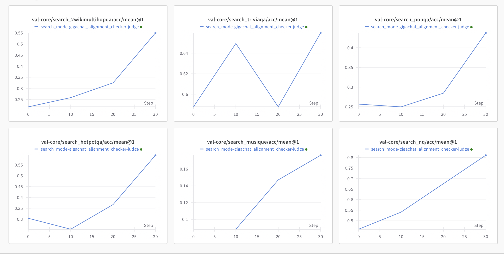

# (lproz) Websearch LLM as Judge

**==Результаты сопоставления обучение с джаджой и обучения на детерм чекере==**

**Задача:** протестировать LLM-as-Judge для сравнения ответов в задачах веб-поиска и сравнить с детерминированным чекером

**Бейзлайн:**

<http://wandb.su:8081/alignment/debug-runs/runs/tzqkrlc3/workspace?nw=nwuserolyandrevn>

Реварды с джаджой стали выше, тк стало меньше false negative:

 

\

На валидации некоторые метрики растут лучше, некоторые хуже: 

  

Проверила метрики которые отрастают хуже, это связано с тем, что в данных golden_answer идет списком вариантов, а не одним вариантом\n\nЗапустили с поправленной джаджой и новым поиском (не Рамблер, а внутренний поиск)

Сопоставление скорости тул колов на внутреннем поиске:

 

Пока только 30 степов, после 25го хорошо пошло вверх

 

Валидации растут, кажется что пофиксили багу с list golden_truth:

 

\

\

\

1. **Что сделано**

==Модели:== Qwen3-30B-A3B и Qwen3-30B-A3B-Instruct-2507. 

==Данные:== nq_hotpotqa (500 семплов) с верными/неверными парами для проверки граничных случаев. Наши генерации (350 семплов). 

==Проверка качества:== Для nq_hotpotqa вручную просмотрела false positive и false negative. Для наших генераций - отфильтровала очевидно правильное дипсиком и вручную проверила остального. Сопоставление ответов при включении/выключении double-check.

2. **Наблюдения**

==Базовая модель (Qwen3-30B-A3B)==: Долго рассуждает, не влезает в лимит токенов -> много false negative (\~40%). 

==Instruct-версия:== Работает лучше. Указание "в очевидных случаях давать ответ сразу, reason step by step иначе" хорошо работает. На nq_hotpotqa: FN \~15/500, FP - в пределах нормы (согласна с разметкой). На наших генерациях: \~150 positive / \~150 negative по версии judge. В 7/300 случаев judge не уложился в 256 токенов, но это сомнительные кейсы и оценка "0" там приемлема. 

==Главная проблема==: Много false positive, когда в \\boxed{} дан длинный текст с верным ответом внутри.

3. **Анализ формата \\boxed{}**

Сравнила, как judge оценивает ответы, если подавать только \\boxed{} vs полный ответ модели.

90% случаев — вердикт не меняется. ==Вывод: \\boxed{} чаще всего не нужен==. 

10% несовпадений: В основном два типа: Сомнительные случаи, где эквивалентность boxed и ground_truth неочевидна. 

Полный текст меняет вердикт judge (поведение становится чуть более случайным). Когда boxed нет или он неполный, а в полном ответе есть нужная информация. 

==Редкие, но важные кейсы:==

 Пример (1): Модель в полном ответе пишет "не знаю", а в boxed ставит правильный ответ. Judge разумно говорит A!=B. 

Вопросы типа "да/нет" или "чем являются оба понятия?": Judge ищет конкретное имя/понятие, а не суть ответа. Нужно дорабатывать промпт или передавать вопрос.

4. **Сопоставление с детерминированным чекером**

Для детерминированного чекера на наших генерациях 121/321 единицы, 210/321 нули. Judge добавила +50 кейсов. Также judge позволяет отказаться от формата boxed, который не очень подходит для веб серч задач.

Есть нежелательное поведение на вопросах с несколькими именами/понятиями в ответе, а также вопросы типа "да/нет" или "чем являются оба понятия?", пока решаем их фильтровать

5. **TO-DO**

Запустить обучение с judge и сопоставить результаты с обучением на детерминированных чеере

\