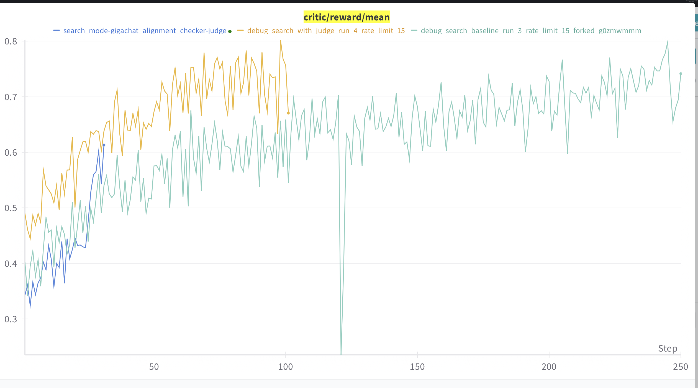
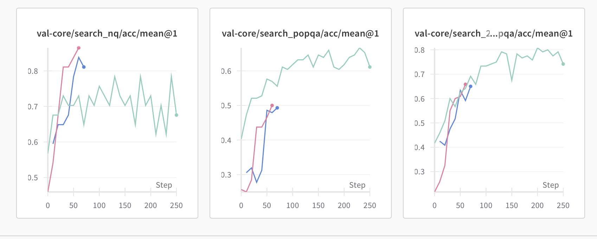

# 9.02 Websearch LLM as Judge

**Задача:**  протестировать обучение с Websearch Judge на внутреннем поиске для boxed и no boxed

==Сопоставление с детерминированным чекером:==

 

**Выводы:**

* Реварды с джаджой стали выше, тк стало меньше false negative
* На внутреннем поиске реварды сначала хуже и хорошо отрастают

\
==Сопоставление no-boxed и boxed джаджы с бейзлайном:== 

 

 

**Выводы:**

* рост boxed и no boxed пока что близкий
* отрастает всё стремительнее, чем с детерминированным чекером