# (mmpavlov) Tool&Agent Benches

# Main Vision

## Цель

Сделать модель:

* устойчивой к неизвестным API (zero-shots),
* способной к многошаговому tool-reasoning,
* умеющей восстанавливаться после ошибок,
* сильной на agentic-бенчмарках,
* пригодной для реального продакшена с внешними API


## **Synthetic Tool Universe — мощный пайп генерации агентских данных:**

* Централизованная система multi-agent генерации траекторий (reasoning + tool-use).
* Жесткий автоматический фильтр качества: unit-тесты, числовая валидация, чекеры, отбраковка shortcut-решений.
* **Code-agent (SWE-like):** генерация собственных репозиториев, багов и задач на патчинг с тестовой верификацией.
* **Code-interpreter agent:** STEM-задачи с curriculum, обязательное использование вычислительных тулов.
* **Search-agent:** multi-hop поиск + QA-пары в стиле BrowseComp / Kimi / DeepSeek, с проверкой источников.
* **General-agent:** синтетические stateful-среды с ограничениями, ошибками и необходимостью планирования.
* Domain randomization API-схем и controlled failure injection.
* Контроль многошаговости и устойчивости к ошибкам (recovery training).
* Вариант - пойти от обратного как в KimiK2 - сначала тулы (реальные + синтетика) → потом таски
* 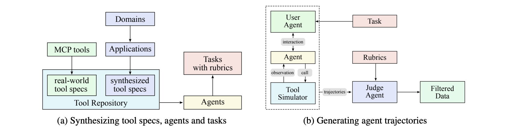


## Takes

* Долгая агентная генерация + контекст 
  * разные техники суммаризаций
  * использование контекста как тула?


* русский язык? search/general агенты специально для русского?
* reasoning - база
* экспы с RL - мало инфы/статей по
  * tool trajectory rewards&advantages - специфичные таски/траектории?
  * tool results OOD problems
  * tau^2 bench related - multi-turn вз-вия и реварды в рамакх одного диалога

# Модели

## DeepSeekv3.2

```javascript
DeepSeek-R1 has demonstrated that incorporating a thinking process can significantly enhance
a model's ability to solve complex problems. Building on this insight, we aim to integrate
thinking capabilities into tool-calling scenarios.
```

 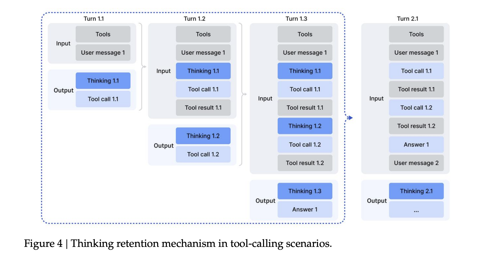

```javascript
Tool-use benchmarks are evaluated using the standard
function call format, wherein models are configured to thinking mode.
```

```javascript
For open models,
we just compare with models supports thinking in tooluse.
```

Темплейты код-старта (есть и то и то):

* Прямой тулколинг без ризонинга 

  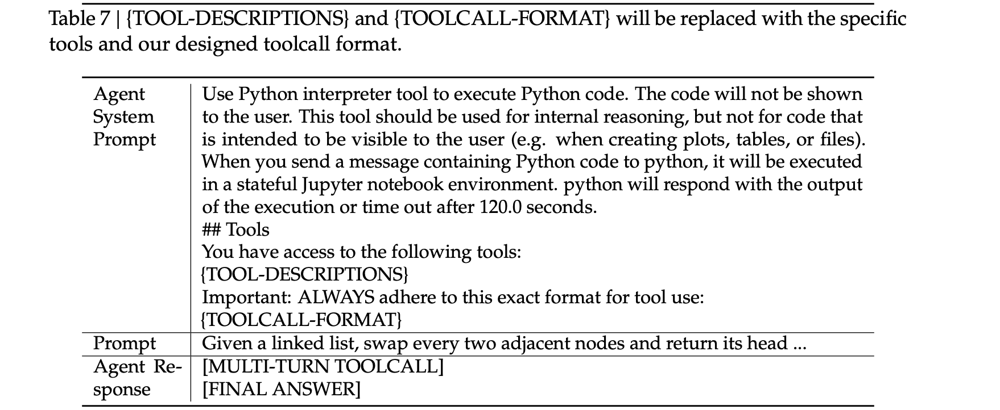


* Тулколинг с промежуточным ризонингом (MULTI-TURN Thinking-Then-TOOLCALL)

 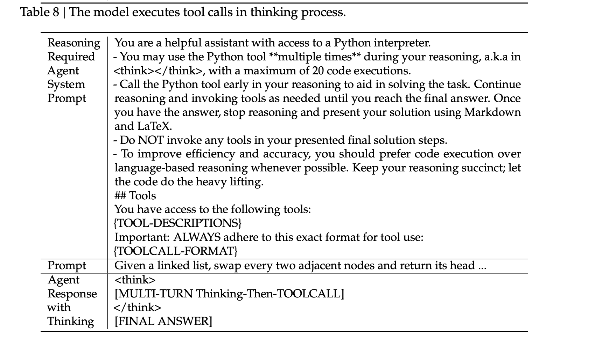

В целом сравнивают tool-calls с/без ризонинга на бенчах, резы похожие на код-агенте, на tool-usage офк разница заметнее 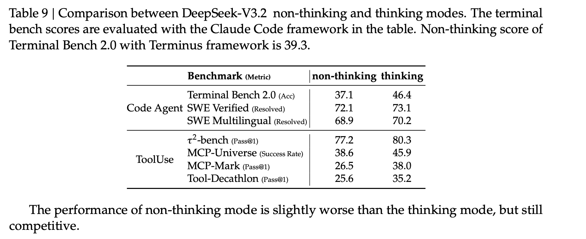

## KimiK2

* Non-thinking (летняя модель/в целом не было ризонинга → качали тулколы/куча синты)

  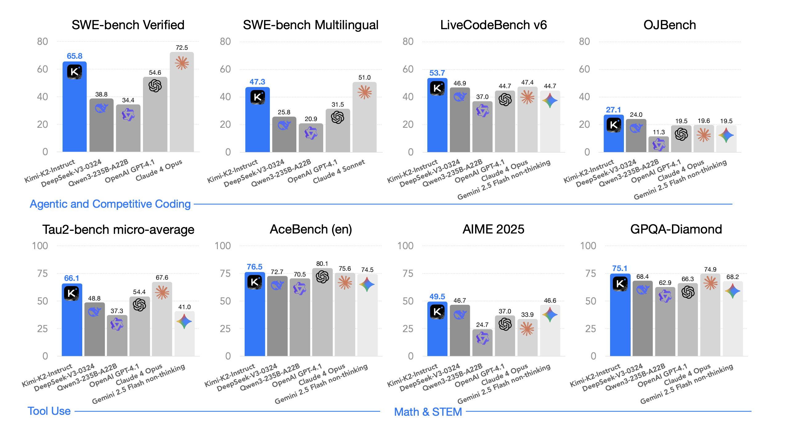

  ```javascript
  All models run in non-thinking
  mode; we set the temperature to 0.0, use deterministic tool adapters
  ```
* Thinking (осенняя модель - добавли ризонинг → как раз 200-300 последовательных тулколов именно тут  за счет промежуточного ризонинга)

  ```javascript
  Kimi K2 Thinking can execute up to 200 – 300 sequential tool calls without human interference, reasoning coherently across hundreds of steps to solve complex problems.  
  ```

    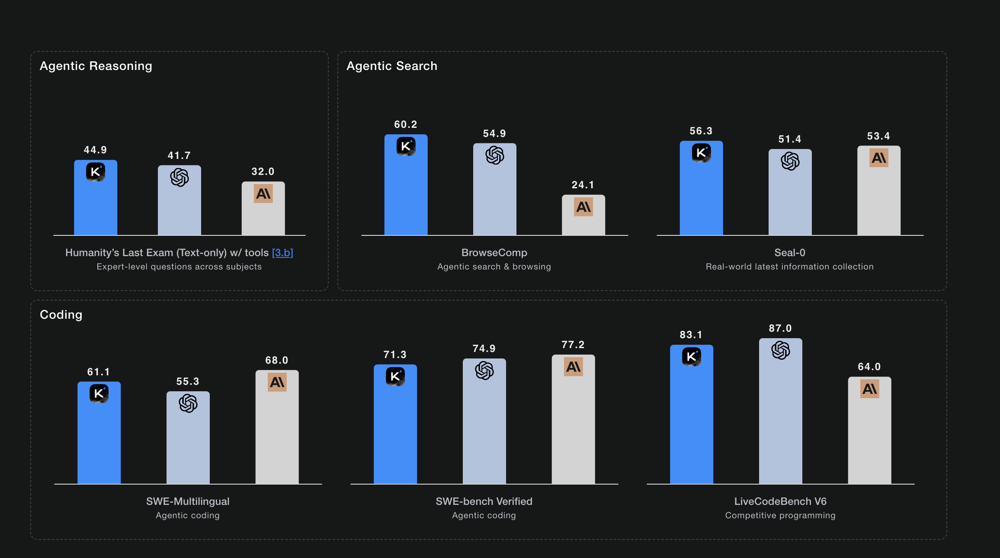

Прирост именно за счет ризонинга  на тулах - [см тех блог](https://moonshotai.github.io/Kimi-K2/thinking.html)

### Пример с Agent reasoning - таска с HLE (math)

Таска

 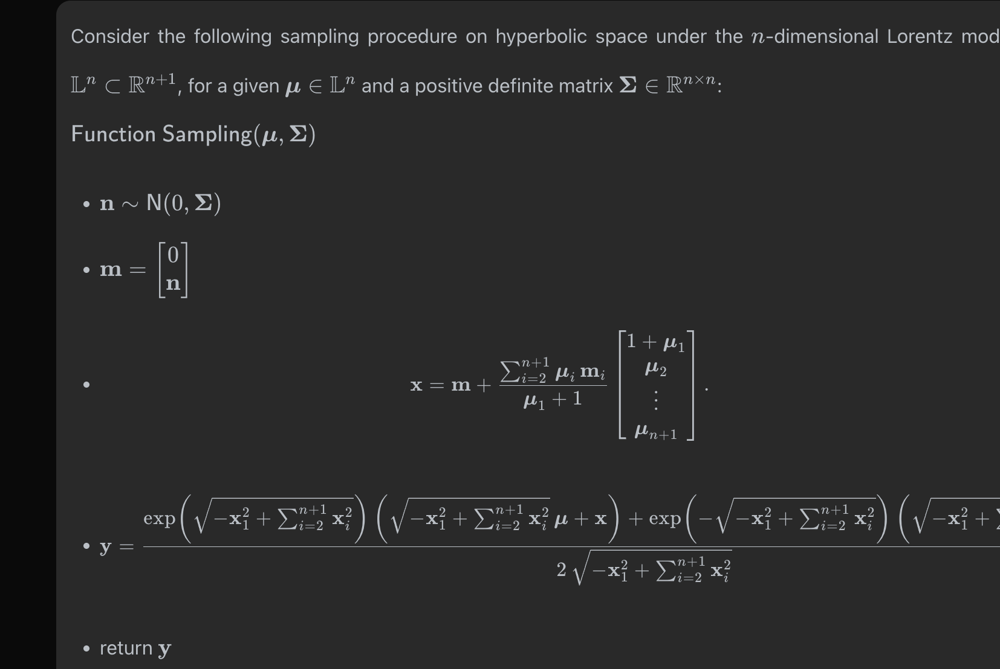

Использование web-search с ризонингом 

 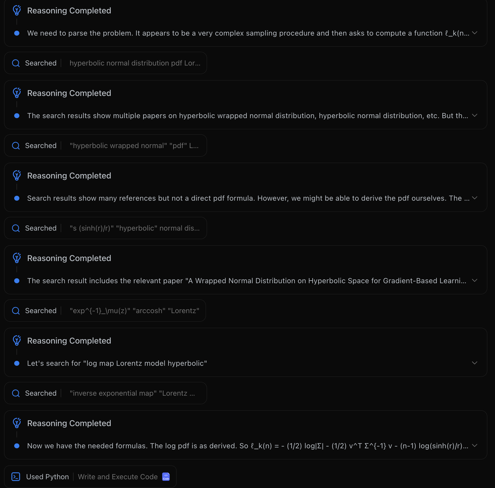

Использование python c ризонингом + ответ 

 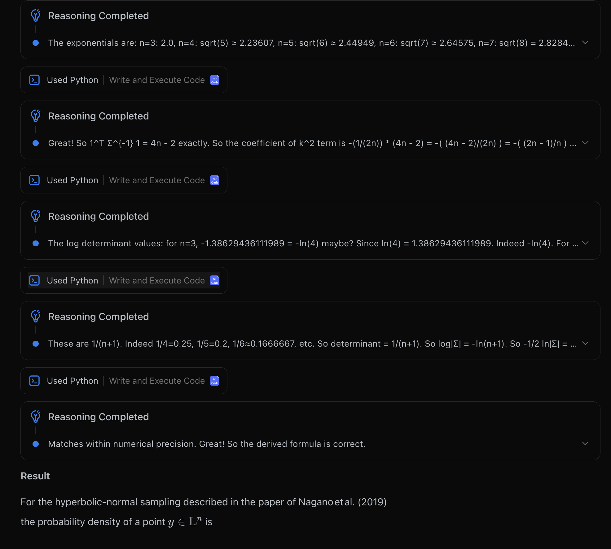

### Пример с **Agentic Search and Browsing - таска с BrowseComp**

```javascript
K2 Thinking can execute ​200–300 sequential tool calls​, driven by long-horizon 
planning and ​adaptive reasoning​. It performs dynamic cycles of ​
think → search → browser use → think → code​, 
continually generating and refining hypotheses, verifying evidence, reasoning, 
and constructing coherent answers. 
This interleaved reasoning allows it to decompose ambiguous, open-ended problems into clear, 
actionable subtasks.
```

 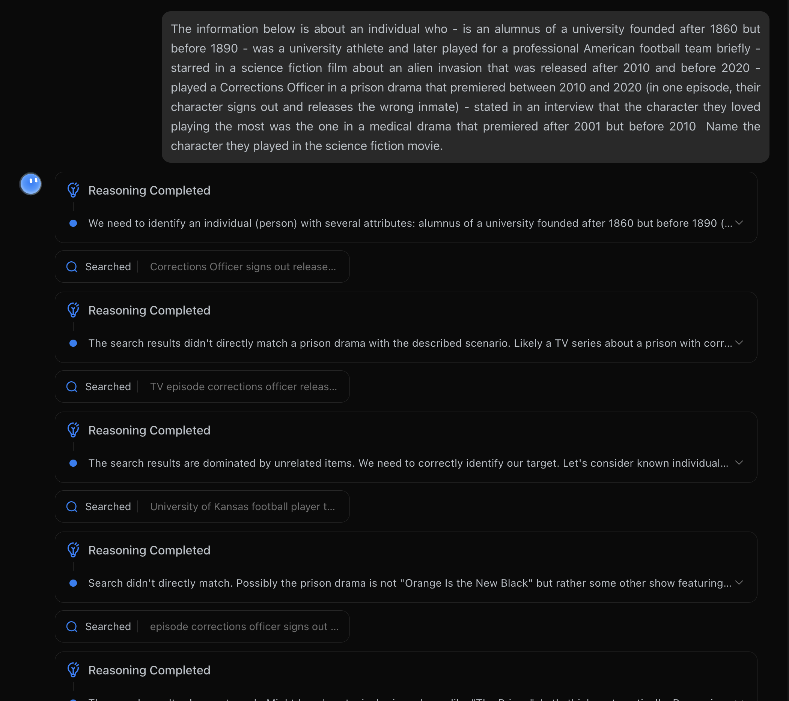

### Результаты

 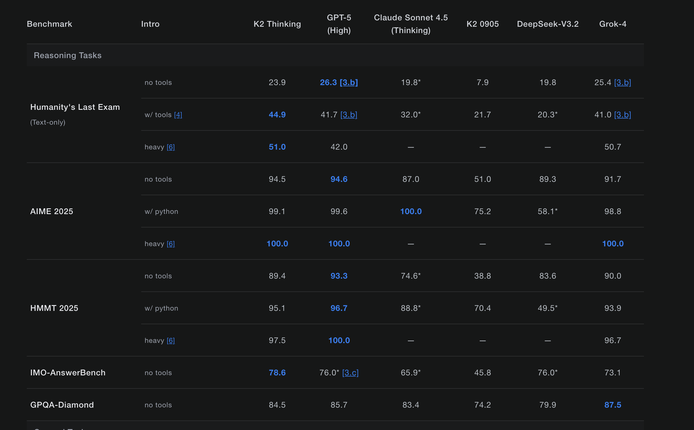 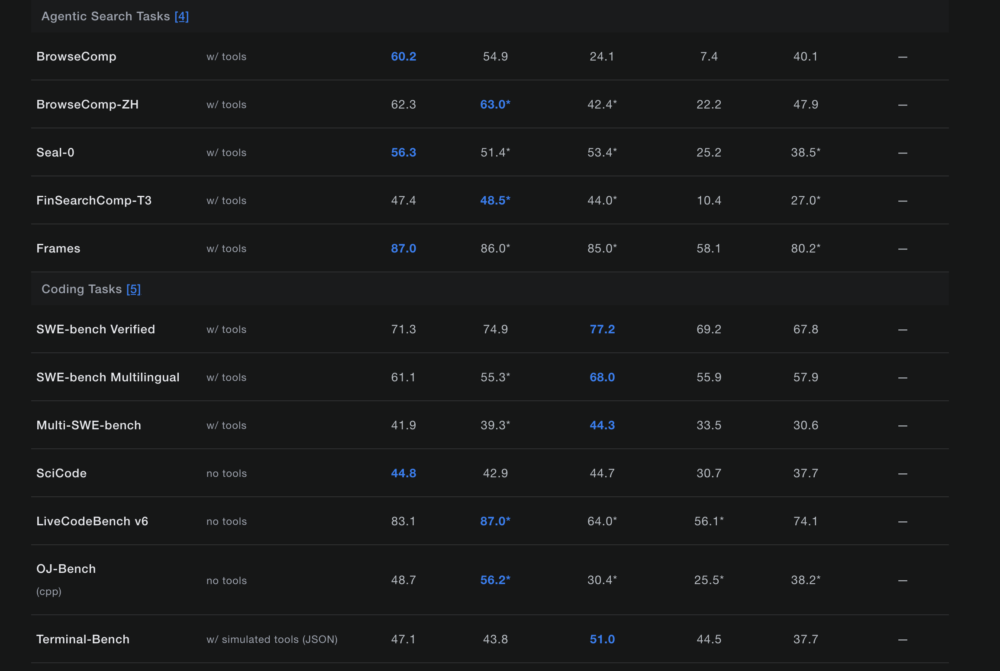


# Бенчи

## SWE-bench Verified


1. Пргоняются часто локально 
2. Для bash-only есть [лидерборд](http://www.swebench.com/index.html) - там есть траектории - но модель просят explicitly сделать секцию 

   THOUGHTS и не дают вызывать в нативном function calling - что немного не валидно 

   (для non-thinking моделей типа KimiK2? для нативного использования function calls?)
3. Для verified - есть лидерборд из агентов но нет траеткорий (нашел только для o1)
4. Frontier models используют ризонинг для интерпретации результатов

   \

## Terminal Bench

* Как SWE-bench, bash-tool - только не для фикса issues, а для инструктивных задачек
* Нет трейсов
* Как правило замеряются на готовых агентах (Terminus 2.0) - хз насчет нативного ризонинга 

## Tau^2

* Ризонинг есть - и точно под капотом
* Трейсы есть (с ризонингом для вызова тулов для gemini 3 pro/gpt 5.2)


## HLE

* 100% ризонинг перед function calls (пример с kimiK2-think)
* Открытых трейсов на frontier модели нет 

## BrowseComp/-zh

* 100% ризонинг на function calls (иначе скип резульатов поиска)

## mcp-univese - указать что frontier сосатьб

# Датасеты

[Датасет с трейсами tau^2 на Qwen235B](https://huggingface.co/datasets/Jarrodbarnes/tau2-sft-v4-dataset)

[SWE-Bench bash-only](https://www.swebench.com/bash-only.html) - есть трейсы!


Ниже — краткое, точное описание бенчмарков + твои наблюдения по текущему состоянию.


---

## **SWE-bench Verified**

**Что измеряет:** Исправление реальных багов в open-source репозиториях. Модель генерирует патч, который должен пройти unit-тесты.

**Особенности:**

* Локальный прогон распространён.
* Для bash-only есть лидерборд с траекториями, но:
  * модель просят явно писать `THOUGHTS`,
  * нет нативного function calling,
  * формат частично невалиден для production tool-агентов.
* Для Verified есть лидерборд агентов, но почти нет открытых трейсов (кроме o1).
* Frontier-модели используют reasoning для интерпретации тест-результатов и итеративного фикса.

**Вывод:** сильный тест long-horizon code-agent, но формат не полностью отражает real tool API usage.


---

## **Terminal Bench**

**Что измеряет:** Работа агента в CLI-среде (bash, файловая система, пакеты) для выполнения инструктивных задач.

**Особенности:**

* По структуре похож на SWE-bench (bash-tool), но не про фиксы багов, а про выполнение задач.
* Нет публичных трейсов.
* Часто измеряется на полноценных агентах (например, Terminus 2.0).
* Неясно, используется ли нативный reasoning или внешний агентный слой.

**Вывод:** сильный тест stateful tool-агента и recovery, но мало прозрачности по внутренним стратегиям моделей.


---

## **Tau²**

**Что измеряет:** Интерактивный tool-use с симуляцией диалога с пользователем и неизвестными API.

**Особенности:**

* Обязательная диалоговая декомпозиция.
* Reasoning используется (минимум под капотом).
* Есть трейсы с reasoning для frontier моделей (Gemini 3 Pro, GPT-5.2).
* Проверяется корректность выбора тулов и аргументов.

**Вывод:** один из наиболее валидных тестов на generalization к unseen tools + интерактивное планирование.


---

## **HLE (Humanity's Last Exam)**

**Что измеряет:** Экстремально сложные reasoning-задачи из разных доменов.

**Особенности:**

* 100% используется reasoning перед tool/function calls (пример: Kimi K2-think).
* Открытых трейсов frontier-моделей практически нет.
* Высокая когнитивная сложность, минимум shortcut-решений.

**Вывод:** тест глубинного reasoning + multi-step tool orchestration.


---

## **BrowseComp / BrowseComp-zh**

**Что измеряет:** Multi-hop веб-поиск + синтез ответа.

**Особенности:**

* Без reasoning невозможно корректно обработать поисковые результаты.
* 100% требуется reasoning перед tool calls (иначе теряется контекст).
* Проверяется обязательное использование search.

**Вывод:** валидный тест search-agent с обязательной декомпозицией и источниковым reasoning.


---

## **MCP-Universe**

**Что измеряет:** Работа с большим набором инструментов в стандартизированном MCP-формате.

**Особенности:**

* Много API, разнообразные схемы.
* Multi-tool сценарии.
* Проверяется масштабируемость tool-политики.

**Наблюдение:** Frontier-модели часто деградируют при росте количества тулов (проблема tool selection scaling и schema overload).

**Вывод:** тест на масштабирование и устойчивость к широкому tool-пространству.


---

Если нужно, могу отдельно:

* сравнить бенчмарки по "насколько они отражают прод",
* или разложить их по типам навыков (planning / selection / recovery / schema generalization).

Ниже — краткое, точное описание бенчмарков + твои наблюдения по текущему состоянию.


---

## **SWE-bench Verified**

**Что измеряет:** Исправление реальных багов в open-source репозиториях. Модель генерирует патч, который должен пройти unit-тесты.

**Особенности:**

* Локальный прогон распространён.
* Для bash-only есть лидерборд с траекториями, но:
  * модель просят явно писать `THOUGHTS`,
  * нет нативного function calling,
  * формат частично невалиден для production tool-агентов.
* Для Verified есть лидерборд агентов, но почти нет открытых трейсов (кроме o1).
* Frontier-модели используют reasoning для интерпретации тест-результатов и итеративного фикса.

**Вывод:** сильный тест long-horizon code-agent, но формат не полностью отражает real tool API usage.


---

## **Terminal Bench**

**Что измеряет:** Работа агента в CLI-среде (bash, файловая система, пакеты) для выполнения инструктивных задач.

**Особенности:**

* По структуре похож на SWE-bench (bash-tool), но не про фиксы багов, а про выполнение задач.
* Нет публичных трейсов.
* Часто измеряется на полноценных агентах (например, Terminus 2.0).
* Неясно, используется ли нативный reasoning или внешний агентный слой.

**Вывод:** сильный тест stateful tool-агента и recovery, но мало прозрачности по внутренним стратегиям моделей.


---

## **Tau²**

**Что измеряет:** Интерактивный tool-use с симуляцией диалога с пользователем и неизвестными API.

**Особенности:**

* Обязательная диалоговая декомпозиция.
* Reasoning используется (минимум под капотом).
* Есть трейсы с reasoning для frontier моделей (Gemini 3 Pro, GPT-5.2).
* Проверяется корректность выбора тулов и аргументов.

**Вывод:** один из наиболее валидных тестов на generalization к unseen tools + интерактивное планирование.


---

## **HLE (Humanity's Last Exam)**

**Что измеряет:** Экстремально сложные reasoning-задачи из разных доменов.

**Особенности:**

* 100% используется reasoning перед tool/function calls (пример: Kimi K2-think).
* Открытых трейсов frontier-моделей практически нет.
* Высокая когнитивная сложность, минимум shortcut-решений.

**Вывод:** тест глубинного reasoning + multi-step tool orchestration.


---

## **BrowseComp / BrowseComp-zh**

**Что измеряет:** Multi-hop веб-поиск + синтез ответа.

**Особенности:**

* Без reasoning невозможно корректно обработать поисковые результаты.
* 100% требуется reasoning перед tool calls (иначе теряется контекст).
* Проверяется обязательное использование search.

**Вывод:** валидный тест search-agent с обязательной декомпозицией и источниковым reasoning.


---

## **MCP-Universe**

**Что измеряет:** Работа с большим набором инструментов в стандартизированном MCP-формате.

**Особенности:**

* Много API, разнообразные схемы.
* Multi-tool сценарии.
* Проверяется масштабируемость tool-политики.

**Наблюдение:** Frontier-модели часто деградируют при росте количества тулов (проблема tool selection scaling и schema overload).

**Вывод:** тест на масштабирование и устойчивость к широкому tool-пространству.


---

Если нужно, могу отдельно:

* сравнить бенчмарки по "насколько они отражают прод",
* или разложить их по типам навыков (planning / selection / recovery / schema generalization).

Ниже — краткое, точное описание бенчмарков + твои наблюдения по текущему состоянию.


---

## **SWE-bench Verified**

**Что измеряет:** Исправление реальных багов в open-source репозиториях. Модель генерирует патч, который должен пройти unit-тесты.

**Особенности:**

* Локальный прогон распространён.
* Для bash-only есть лидерборд с траекториями, но:
  * модель просят явно писать `THOUGHTS`,
  * нет нативного function calling,
  * формат частично невалиден для production tool-агентов.
* Для Verified есть лидерборд агентов, но почти нет открытых трейсов (кроме o1).
* Frontier-модели используют reasoning для интерпретации тест-результатов и итеративного фикса.

**Вывод:** сильный тест long-horizon code-agent, но формат не полностью отражает real tool API usage.


---

## **Terminal Bench**

**Что измеряет:** Работа агента в CLI-среде (bash, файловая система, пакеты) для выполнения инструктивных задач.

**Особенности:**

* По структуре похож на SWE-bench (bash-tool), но не про фиксы багов, а про выполнение задач.
* Нет публичных трейсов.
* Часто измеряется на полноценных агентах (например, Terminus 2.0).
* Неясно, используется ли нативный reasoning или внешний агентный слой.

**Вывод:** сильный тест stateful tool-агента и recovery, но мало прозрачности по внутренним стратегиям моделей.


---

## **Tau²**

**Что измеряет:** Интерактивный tool-use с симуляцией диалога с пользователем и неизвестными API.

**Особенности:**

* Обязательная диалоговая декомпозиция.
* Reasoning используется (минимум под капотом).
* Есть трейсы с reasoning для frontier моделей (Gemini 3 Pro, GPT-5.2).
* Проверяется корректность выбора тулов и аргументов.

**Вывод:** один из наиболее валидных тестов на generalization к unseen tools + интерактивное планирование.


---

## **HLE (Humanity's Last Exam)**

**Что измеряет:** Экстремально сложные reasoning-задачи из разных доменов.

**Особенности:**

* 100% используется reasoning перед tool/function calls (пример: Kimi K2-think).
* Открытых трейсов frontier-моделей практически нет.
* Высокая когнитивная сложность, минимум shortcut-решений.

**Вывод:** тест глубинного reasoning + multi-step tool orchestration.


---

## **BrowseComp / BrowseComp-zh**

**Что измеряет:** Multi-hop веб-поиск + синтез ответа.

**Особенности:**

* Без reasoning невозможно корректно обработать поисковые результаты.
* 100% требуется reasoning перед tool calls (иначе теряется контекст).
* Проверяется обязательное использование search.

**Вывод:** валидный тест search-agent с обязательной декомпозицией и источниковым reasoning.


---

## **MCP-Universe**

**Что измеряет:** Работа с большим набором инструментов в стандартизированном MCP-формате.

**Особенности:**

* Много API, разнообразные схемы.
* Multi-tool сценарии.
* Проверяется масштабируемость tool-политики.

**Наблюдение:** Frontier-модели часто деградируют при росте количества тулов (проблема tool selection scaling и schema overload).

**Вывод:** тест на масштабирование и устойчивость к широкому tool-пространству.


---

Если нужно, могу отдельно:

* сравнить бенчмарки по "насколько они отражают прод",
* или разложить их по типам навыков (planning / selection / recovery / schema generalization).

Ниже — краткое, точное описание бенчмарков + твои наблюдения по текущему состоянию.


---

## **SWE-bench Verified**

**Что измеряет:** Исправление реальных багов в open-source репозиториях. Модель генерирует патч, который должен пройти unit-тесты.

**Особенности:**

* Локальный прогон распространён.
* Для bash-only есть лидерборд с траекториями, но:
  * модель просят явно писать `THOUGHTS`,
  * нет нативного function calling,
  * формат частично невалиден для production tool-агентов.
* Для Verified есть лидерборд агентов, но почти нет открытых трейсов (кроме o1).
* Frontier-модели используют reasoning для интерпретации тест-результатов и итеративного фикса.

**Вывод:** сильный тест long-horizon code-agent, но формат не полностью отражает real tool API usage.


---

## **Terminal Bench**

**Что измеряет:** Работа агента в CLI-среде (bash, файловая система, пакеты) для выполнения инструктивных задач.

**Особенности:**

* По структуре похож на SWE-bench (bash-tool), но не про фиксы багов, а про выполнение задач.
* Нет публичных трейсов.
* Часто измеряется на полноценных агентах (например, Terminus 2.0).
* Неясно, используется ли нативный reasoning или внешний агентный слой.

**Вывод:** сильный тест stateful tool-агента и recovery, но мало прозрачности по внутренним стратегиям моделей.


---

## **Tau²**

**Что измеряет:** Интерактивный tool-use с симуляцией диалога с пользователем и неизвестными API.

**Особенности:**

* Обязательная диалоговая декомпозиция.
* Reasoning используется (минимум под капотом).
* Есть трейсы с reasoning для frontier моделей (Gemini 3 Pro, GPT-5.2).
* Проверяется корректность выбора тулов и аргументов.

**Вывод:** один из наиболее валидных тестов на generalization к unseen tools + интерактивное планирование.


---

## **HLE (Humanity's Last Exam)**

**Что измеряет:** Экстремально сложные reasoning-задачи из разных доменов.

**Особенности:**

* 100% используется reasoning перед tool/function calls (пример: Kimi K2-think).
* Открытых трейсов frontier-моделей практически нет.
* Высокая когнитивная сложность, минимум shortcut-решений.

**Вывод:** тест глубинного reasoning + multi-step tool orchestration.


---

## **BrowseComp / BrowseComp-zh**

**Что измеряет:** Multi-hop веб-поиск + синтез ответа.

**Особенности:**

* Без reasoning невозможно корректно обработать поисковые результаты.
* 100% требуется reasoning перед tool calls (иначе теряется контекст).
* Проверяется обязательное использование search.

**Вывод:** валидный тест search-agent с обязательной декомпозицией и источниковым reasoning.


---

## **MCP-Universe**

**Что измеряет:** Работа с большим набором инструментов в стандартизированном MCP-формате.

**Особенности:**

* Много API, разнообразные схемы.
* Multi-tool сценарии.
* Проверяется масштабируемость tool-политики.

**Наблюдение:** Frontier-модели часто деградируют при росте количества тулов (проблема tool selection scaling и schema overload).

**Вывод:** тест на масштабирование и устойчивость к широкому tool-пространству.


---

Если нужно, могу отдельно:

* сравнить бенчмарки по "насколько они отражают прод",
* или разложить их по типам навыков (planning / selection / recovery / schema generalization).


\

\

\

\

\

Кстати у меня щас 

Ниже — краткое, точное описание бенчмарков + твои наблюдения по текущему состоянию.


---

## **SWE-bench Verified**

**Что измеряет:** Исправление реальных багов в open-source репозиториях. Модель генерирует патч, который должен пройти unit-тесты.

**Особенности:**

* Локальный прогон распространён.
* Для bash-only есть лидерборд с траекториями, но:
  * модель просят явно писать `THOUGHTS`,
  * нет нативного function calling,
  * формат частично невалиден для production tool-агентов.
* Для Verified есть лидерборд агентов, но почти нет открытых трейсов (кроме o1).
* Frontier-модели используют reasoning для интерпретации тест-результатов и итеративного фикса.

**Вывод:** сильный тест long-horizon code-agent, но формат не полностью отражает real tool API usage.


---

## **Terminal Bench**

**Что измеряет:** Работа агента в CLI-среде (bash, файловая система, пакеты) для выполнения инструктивных задач.

**Особенности:**

* По структуре похож на SWE-bench (bash-tool), но не про фиксы багов, а про выполнение задач.
* Нет публичных трейсов.
* Часто измеряется на полноценных агентах (например, Terminus 2.0).
* Неясно, используется ли нативный reasoning или внешний агентный слой.

**Вывод:** сильный тест stateful tool-агента и recovery, но мало прозрачности по внутренним стратегиям моделей.


---

## **Tau²**

**Что измеряет:** Интерактивный tool-use с симуляцией диалога с пользователем и неизвестными API.

**Особенности:**

* Обязательная диалоговая декомпозиция.
* Reasoning используется (минимум под капотом).
* Есть трейсы с reasoning для frontier моделей (Gemini 3 Pro, GPT-5.2).
* Проверяется корректность выбора тулов и аргументов.

**Вывод:** один из наиболее валидных тестов на generalization к unseen tools + интерактивное планирование.


---

## **HLE (Humanity's Last Exam)**

**Что измеряет:** Экстремально сложные reasoning-задачи из разных доменов.

**Особенности:**

* 100% используется reasoning перед tool/function calls (пример: Kimi K2-think).
* Открытых трейсов frontier-моделей практически нет.
* Высокая когнитивная сложность, минимум shortcut-решений.

**Вывод:** тест глубинного reasoning + multi-step tool orchestration.


---

## **BrowseComp / BrowseComp-zh**

**Что измеряет:** Multi-hop веб-поиск + синтез ответа.

**Особенности:**

* Без reasoning невозможно корректно обработать поисковые результаты.
* 100% требуется reasoning перед tool calls (иначе теряется контекст).
* Проверяется обязательное использование search.

**Вывод:** валидный тест search-agent с обязательной декомпозицией и источниковым reasoning.


---

## **MCP-Universe**

**Что измеряет:** Работа с большим набором инструментов в стандартизированном MCP-формате.

**Особенности:**

* Много API, разнообразные схемы.
* Multi-tool сценарии.
* Проверяется масштабируемость tool-политики.

**Наблюдение:** Frontier-модели часто деградируют при росте количества тулов (проблема tool selection scaling и schema overload).

**Вывод:** тест на масштабирование и устойчивость к широкому tool-пространству.


---

Если нужно, могу отдельно:

* сравнить бенчмарки по "насколько они отражают прод",
* или разложить их по типам навыков (planning / selection / recovery / schema generalization).


\

\

\
# 

# 


---

## **SWE-bench Verified**

**Что измеряет:** Исправление реальных багов в open-source репозиториях. Модель генерирует патч, который должен пройти unit-тесты.

**Особенности:**

* Локальный прогон распространён.
* Для bash-only есть лидерборд с траекториями, но:
  * модель просят явно писать `THOUGHTS`,
  * нет нативного function calling,
  * формат частично невалиден для production tool-агентов.
* Для Verified есть лидерборд агентов, но почти нет открытых трейсов (кроме o1).
* Frontier-модели используют reasoning для интерпретации тест-результатов и итеративного фикса.

**Вывод:** сильный тест long-horizon code-agent, но формат не полностью отражает real tool API usage.


---

## **Terminal Bench**

**Что измеряет:** Работа агента в CLI-среде (bash, файловая система, пакеты) для выполнения инструктивных задач.

**Особенности:**

* По структуре похож на SWE-bench (bash-tool), но не про фиксы багов, а про выполнение задач.
* Нет публичных трейсов.
* Часто измеряется на полноценных агентах (например, Terminus 2.0).
* Неясно, используется ли нативный reasoning или внешний агентный слой.

**Вывод:** сильный тест stateful tool-агента и recovery, но мало прозрачности по внутренним стратегиям моделей.


---

## **Tau²**

**Что измеряет:** Интерактивный tool-use с симуляцией диалога с пользователем и неизвестными API.

**Особенности:**

* Обязательная диалоговая декомпозиция.
* Reasoning используется (минимум под капотом).
* Есть трейсы с reasoning для frontier моделей (Gemini 3 Pro, GPT-5.2).
* Проверяется корректность выбора тулов и аргументов.

**Вывод:** один из наиболее валидных тестов на generalization к unseen tools + интерактивное планирование.


---

## **HLE (Humanity's Last Exam)**

**Что измеряет:** Экстремально сложные reasoning-задачи из разных доменов.

**Особенности:**

* 100% используется reasoning перед tool/function calls (пример: Kimi K2-think).
* Открытых трейсов frontier-моделей практически нет.
* Высокая когнитивная сложность, минимум shortcut-решений.

**Вывод:** тест глубинного reasoning + multi-step tool orchestration.


---

## **BrowseComp / BrowseComp-zh**

**Что измеряет:** Multi-hop веб-поиск + синтез ответа.

**Особенности:**

* Без reasoning невозможно корректно обработать поисковые результаты.
* 100% требуется reasoning перед tool calls (иначе теряется контекст).
* Проверяется обязательное использование search.

**Вывод:** валидный тест search-agent с обязательной декомпозицией и источниковым reasoning.


---

## **MCP-Universe**

**Что измеряет:** Работа с большим набором инструментов в стандартизированном MCP-формате.

**Особенности:**

* Много API, разнообразные схемы.
* Multi-tool сценарии.
* Проверяется масштабируемость tool-политики.

**Наблюдение:** Frontier-модели часто деградируют при росте количества тулов (проблема tool selection scaling и schema overload).

**Вывод:** тест на масштабирование и устойчивость к широкому tool-пространству.


---

Если нужно, могу отдельно:

* сравнить бенчмарки по "насколько они отражают прод",
* или разложить их по типам навыков (planning / selection / recovery / schema generalization).